# 🔋 Battery Prognostics — Full Project Presentation Summary

**This is the single reference document for the project presentation.** It is deliberately exhaustive rather than curated: every session/phase that produced a real result is covered, every plot that session produced is embedded, every CSV's key contents are reproduced as tables, and every honest negative/limitation finding is reported alongside the positive ones — exactly as `DEVELOPMENT_LOG.md` recorded them. Numbers below are copied from `DEVELOPMENT_LOG.md` and the underlying CSV/JSON output files, not paraphrased or re-rounded.

## Project summary

This project builds a full lithium-ion battery State-of-Health (SOH) and Remaining-Useful-Life (RUL) prognostics pipeline on pooled **NASA PCoE + MIT/Stanford (Severson) + CALCE CS2** cycling data (26,996 total cycles across 35 batteries): 16 hand-engineered Health Indicators + Binary Firefly Algorithm (BFA) feature selection, four/five base learners (XGBoost, VLSTM, CNN-LSTM, PiFormer, CNN-BiGRU), a stacking ensemble, an ICA/DV/DC CNN-encoder feature-fusion step, split-conformal uncertainty intervals, SHAP/LIME explainability, a joint SOH+RUL multi-task model with adaptive loss weighting, and — across 31 follow-up sessions — a long chain of genuine extensions and stress-tests: MMD domain adaptation, domain-shift-aware conformal prediction, bootstrap significance testing, model quantization, second-life grading, sensor-noise robustness, root-cause analysis of the pipeline's weakest test battery, and a real online-learning "Digital Twin" streaming mode with Adaptive Conformal Inference, all surfaced in a Streamlit dashboard. The project's development practice, visible throughout this document, was to report negative and null results as plainly as positive ones, and to root-cause anomalies (bugs, stale files, statistical artifacts) rather than pass them through unexamined.

## Headline numbers (verified against `DEVELOPMENT_LOG.md`)

| Metric | Value | Source |
|---|---|---|
| Best single base learner | XGBoost, RMSE=1.478, MAE=0.990, **R²=0.907** | Phase 2 re-run / `data/processed/predictions/xgb_metrics.csv` |
| Best model overall (fusion-augmented) | XGBoost+fusion, RMSE=1.392, MAE=0.959, **R²=0.917** | Follow-up session 3 / `xgb_fusion_metrics.csv` |
| Lean vs. full deployment latency | **~52x faster** (3.9ms vs. 201.9ms per prediction, batch=1) | Follow-up session 20 / `outputs/lean_vs_full_comparison.csv` |
| CALCE (out-of-domain) conformal coverage collapse | **95.6% → 6.1%** (identical fixed interval width both domains) | Follow-up session 5 / `outputs/calce_zero_retrain_conformal.csv` |
| CALCE zero-retrain point-prediction collapse | R² 0.917 → **0.304–0.314** | Follow-up session 5 |
| Digital Twin online correction (NASA/B0018) | Overall MAE **4.641 → 4.426** (raw → corrected) | Follow-up session 28 |
| ACI conformal coverage gains (streaming twin) | B0018: 82.0%→**85.9%**; MIT/b3c35: 84.2%→**87.2%** | Follow-up session 29 |
| CNN-LSTM root-cause fix | R² **-0.071 → 0.334** (dVdQ channel reached ~9.5 million unnormalized) | CNN-LSTM root-cause fix session |
| Original conformal-calibration bug caught | Coverage **27.1% → 95.1%** (in-sample vs. proper calib/eval split) | Phase 6 |

---

## Table of contents

1. [Phase 1 — Health Indicators, BFA feature selection, RUL labels, ICA/DV/DC](#phase-1)
2. [Phase 2 (original) — Base learners: XGBoost + 3 deep models](#phase-2-orig)
3. [Phase 3 (original) — Stacking ensemble](#phase-3-orig)
4. [Phase 4 (original) — Joint SOH+RUL ablation, confounded run](#phase-4-orig)
5. [Phase 5 (original) — SHAP explainability](#phase-5-orig)
6. [Phase 6 (original) — Split-conformal prediction, the 27.1% bug](#phase-6-orig)
7. [CNN-LSTM root-cause fix](#cnnlstm-fix)
8. [Phase 2/3/4/6 re-run (post-fix)](#post-fix-rerun)
9. [Follow-up session 2 — log_sigma clamping](#session-2)
10. [Follow-up session 3 — ICA/DV/DC feature fusion](#session-3)
11. [Follow-up session 4 — physics-informed monotonicity loss](#session-4)
12. [Follow-up session 5 — CALCE zero-retrain evaluation](#session-5)
13. [Follow-up session 6 — plain-English health report generator](#session-6)
14. [Follow-up session 7 — Streamlit Digital Twin dashboard (v1)](#session-7)
15. [Phase 5 re-run — CNN-LSTM SHAP now meaningful](#phase5-rerun)
16. [Follow-up session 8 — Gemini LLM switch](#session-8)
17. [Follow-up session 9 — 3 evaluation-protocol experiments](#session-9)
18. [Follow-up session 10 — surfaced experiments in dashboard](#session-10)
19. [Follow-up session 11 — RUL conformal coverage investigation](#session-11)
20. [Follow-up session 12 — graceful degradation (deploy fix)](#session-12)
21. [Follow-up session 13 — MMD domain adaptation](#session-13)
22. [Follow-up session 14 — softmax-normalized adaptive loss weighting](#session-14)
23. [Follow-up session 15 — LIME cross-validation](#session-15)
24. [Follow-up session 16 — knee-point detection](#session-16)
25. [Follow-up session 17 — CNN-BiGRU 5th base learner](#session-17)
26. [Follow-up session 18 — consolidated convergence comparison](#session-18)
27. [Follow-up session 19 — domain-shift-aware conformal prediction](#session-19)
28. [Follow-up session 20 — lean vs. full deployment comparison](#session-20)
29. [Follow-up session 21 — bootstrap confidence intervals](#session-21)
30. [Follow-up session 22 — NASA EIS features](#session-22)
31. [Follow-up session 23 — degradation-mode dV/dQ peak-tracking](#session-23)
32. [Follow-up session 24 — model quantization / TinyML feasibility](#session-24)
33. [Follow-up session 25 — second-life grading classifier](#session-25)
34. [Follow-up session 26 — sensor-noise robustness](#session-26)
35. [Follow-up session 27 — B0018 root-cause analysis](#session-27)
36. [Follow-up session 28 — streaming Digital Twin (online learning)](#session-28)
37. [Follow-up session 29 — Adaptive Conformal Inference (ACI)](#session-29)
38. [Follow-up session 30 — Digital Twin Showcase tab](#session-30)
39. [Follow-up session 31 — broken-tabs fix + visual pass](#session-31)
40. [Full file index](#file-index)
41. [Verification](#verification)

---

## 1. Phase 1 — Health Indicators, BFA feature selection, RUL labels, ICA/DV/DC

**Compute environment note (applies throughout the project):** CPU Intel Core 7 150U, 12 logical cores, **no GPU**, ~16GB RAM (~2.8GB free at run start). All deep-learning training ran on CPU via PyTorch — the single biggest scope constraint of the whole project, stated up front rather than re-litigated per phase.

Built the core pipeline modules: `data_adapters.py` (normalizes NASA/CALCE/MIT into common per-cycle records), `health_indicators.py` (16 hand-engineered HIs: CDECT, ICHV, UVP, SCV, VDEDT, VIECT, LVP, MATC, MATD, MATDL, MET, TCCC, TCVC, TECD, TEVD, TEVI), `rul_labels.py` (EOL = first cycle where capacity ≤ 80% of the median of the first 3 cycles' capacity), `ica_dv_dc.py` (dQ/dV, dV/dQ, dI/dV on a 200-point voltage grid, Savitzky-Golay smoothed), `bfa_feature_selection.py` (S-shaped binary firefly algorithm wrapper feature selection).

**MIT subset selection**: 28 of 185 available MIT cells picked (7 per batch × 4 batches), evenly spaced along each batch's sorted cycle-life percentile range so the subset spans short- to long-life cells. Cycle-life range covered: 148 to 1,935 cycles.

**Full feature extraction — complete**: 35/35 batteries processed, **26,996 total cycles** (NASA 636, CALCE 2,943, MIT 23,417). Runtime: NASA ~0.6s/battery, CALCE ~130s/battery, MIT 2.7–30s/battery; total wall time ~13 minutes.

**Finding worth flagging (honest, not glossed over)**: most MIT batch-1 and several batch-3 cells come back `censored=True` under this project's own EOL rule, even though MIT's own HDF5 `cycle_life` field reports a finite number for the same cells (e.g. b1c4: 1225 logged cycles, never crosses 80% SOH under this project's rule, yet MIT's own field reports cycle_life=1227) — a genuine methodological difference in EOL definition, not a bug; both labelings are kept.

**BFA feature selection — complete**: one bug caught (pandas read-only-array crash from `to_numpy(dtype=float)`, fixed with `copy=True`). Ran at full literature-standard scale: 30 agents × 100 iterations = 3,000 wrapper-fitness evaluations. Baseline RMSE (all 16 features) = **3.897**. Converged by iteration ~60 to **RMSE=2.864 using 7/16 features** — better than using all 16.

**Selected 7 features: ICHV, SCV, VDEDT, VIECT, MATC, MATD, TEVI.** Notably kept both temperature HIs (MATC, MATD) despite CALCE's 8,829 imputed NaN cells for them — the real NASA/MIT temperature signal outweighed CALCE's imputation noise. Also notably dropped TCCC/TCVC/TECD/TEVD (raw CC/CV timing) in favor of TEVI/VDEDT/VIECT (voltage-shape indicators).

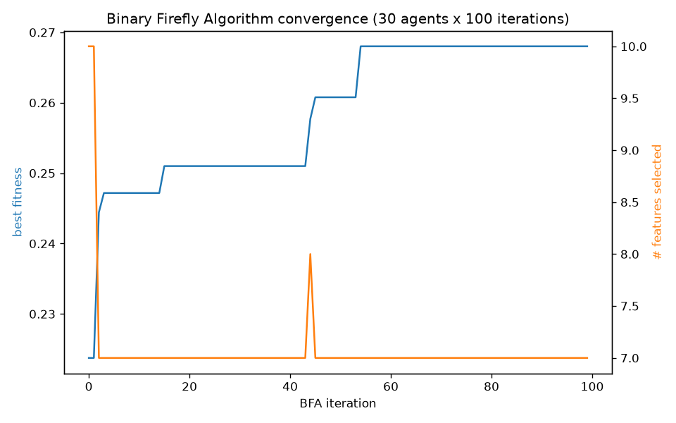
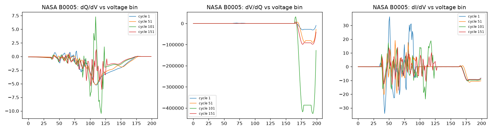
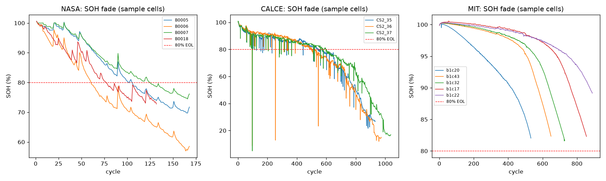

---

## 2. Phase 2 (original, pre-fix) — Base learners

**XGBoost — complete, with a split bug caught and fixed**: the first battery-level split ("every 5th battery in sorted order") put **zero NASA batteries in the test set** (NASA sorts first alphabetically and has exactly 4 batteries, landing entirely inside the MIT block for a stride-5 slice). First-run numbers (RMSE=0.954, R²=0.955) were real but not representative. Fixed by stratifying the split per-dataset.

**Final XGBoost result (26 train / 6 test batteries)**: **RMSE=1.479, MAE=0.990, R²=0.907**.

**VLSTM / CNN-LSTM / PiFormer — complete (~65 min wall time)**. A target-standardization bug was caught and fixed during smoke-testing before the real run (val MSE was stuck ~5100 without z-scoring the SOH target). Full run: 21 fit / 5 val / 6 test batteries, 14,872 fit cycles, 40-epoch budget, early-stopping patience=8.

| model | RMSE | MAE | R² | epochs run |
|---|---|---|---|---|
| VLSTM | 2.694 | 1.634 | 0.690 | 40 (no early stop, still improving) |
| CNN-LSTM | 5.006 | 3.952 | **-0.071** | 8 (early-stopped, never improved) |
| PiFormer | 2.491 | 1.571 | 0.735 | 28 (early-stopped) |

**CNN-LSTM did not learn** — R²=-0.071 means worse than predicting the mean SOH for every test row. Working hypothesis at the time (unverified, flagged for follow-up): BatchNorm1d instability. The project proceeded with the ensemble as-is, since the stacking meta-learner could in principle learn to downweight a bad base learner. (This bug was later root-caused — see [section 7](#cnnlstm-fix).)

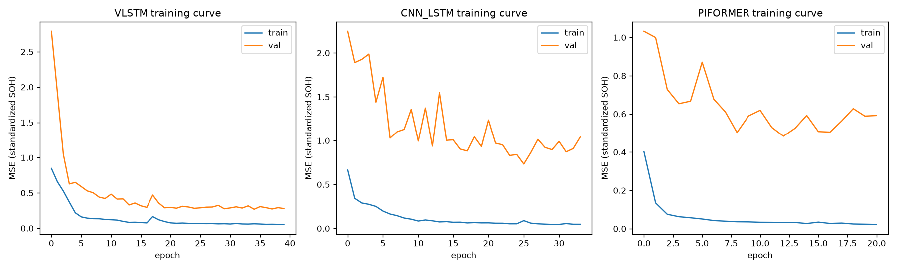

---

## 3. Phase 3 (original, pre-fix) — Stacking ensemble

| model | RMSE | MAE | R² |
|---|---|---|---|
| XGBoost | 1.478 | 0.990 | 0.907 |
| Stacking-Ridge | 1.480 | 0.989 | 0.906 |
| Stacking-XGBoost | 1.490 | 0.992 | 0.905 |
| PiFormer | 2.491 | 1.571 | 0.735 |
| VLSTM | 2.694 | 1.634 | 0.690 |
| CNN-LSTM | 5.006 | 3.952 | -0.071 |

**Honest finding, not a bug: stacking did not beat the single best base learner.** Ridge meta-learner coefficients: `{XGBoost: 1.011, VLSTM: -0.007, CNNLSTM: -0.036, PiFormer: -0.004}` — it essentially learned to ignore all three deep models and reproduce XGBoost's prediction almost verbatim, the correct behavior given XGBoost was dramatically stronger than the deep models at this point.

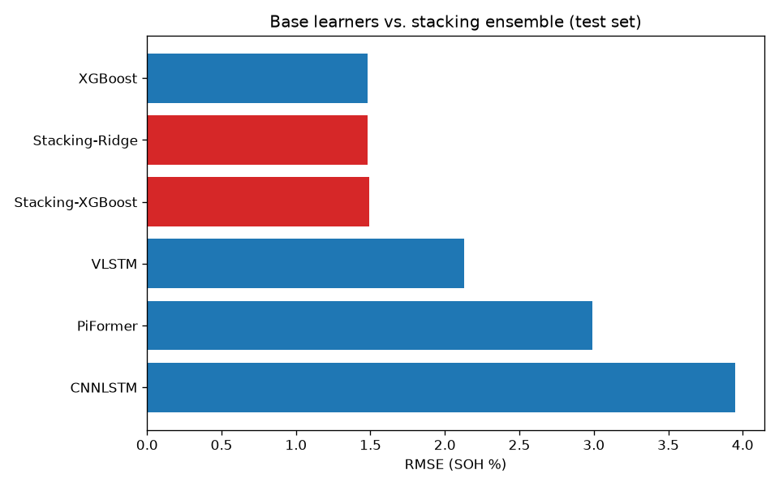
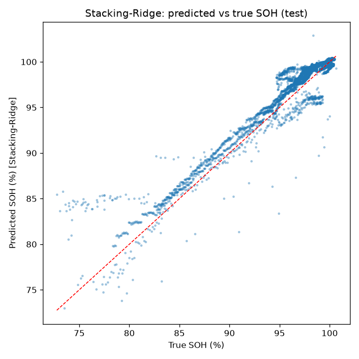

---

## 4. Phase 4 (original, pre-fix) — Joint SOH+RUL ablation, confounded run

All 4 variants (fixed_balanced, soh_only, rul_only, adaptive) trained cleanly for 25 epochs (1308s total):

| variant | RUL RMSE | SOH RMSE | RUL R² | SOH R² |
|---|---|---|---|---|
| adaptive | **335.65** | 4.891 | -0.002 | -0.023 |
| fixed_balanced | 337.03 | 4.944 | -0.010 | -0.045 |
| rul_only | 337.69 | **4.850** | -0.014 | -0.006 |
| soh_only | 350.34 | 4.874 | -0.091 | -0.016 |

**Honest read, not the clean story the ablation was designed to demonstrate**: the joint model shares its backbone with Phase 2's already-broken CNN-LSTM. `val_soh` sat flat at ~2.8–3.0 across ALL FOUR variants for the entire 25 epochs — the backbone wasn't extracting useful SOH signal regardless of loss weighting, so every variant's SOH R² was negative. `rul_only`'s SOH RMSE (4.850) did **not** show the expected mirror-collapse — it was actually the *best* SOH number of the four, breaking the clean narrative; attributed to backbone-ceiling noise dominating which random init "wins." Flagged for follow-up alongside the CNN-LSTM fix.

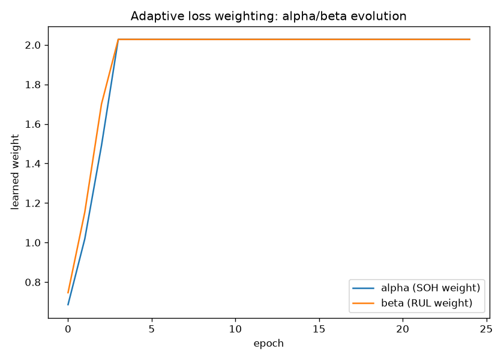
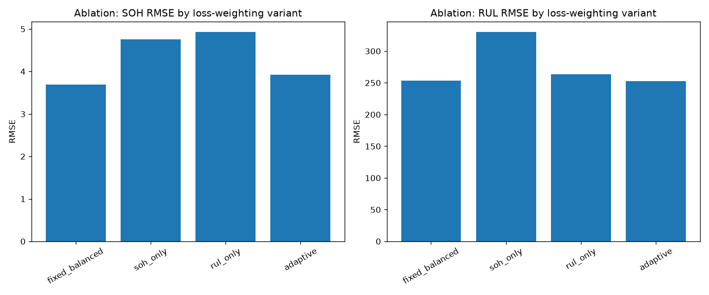
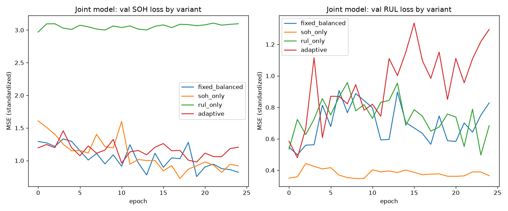

---

## 5. Phase 5 (original, pre-fix) — SHAP explainability

DeepSHAP succeeded on all 3 deep models directly (no KernelSHAP fallback needed), including CNN-LSTM (`nn.LSTM`) and PiFormer (`nn.MultiheadAttention`+`nn.LayerNorm`) — layers DeepSHAP is historically flaky with.

**TreeSHAP, XGBoost base learner** (mean|SHAP| over the 7 BFA-selected features):

| feature | mean\|SHAP\| |
|---|---|
| SCV | 2.266 |
| VIECT | 1.934 |
| TEVI | 0.905 |
| ICHV | 0.244 |
| MATC | 0.199 |
| MATD | 0.136 |
| VDEDT | 0.066 |

Top-3 (SCV, VIECT, TEVI) exactly match the voltage-shape features BFA's own history showed converging on early — cross-validating BFA's selection independently.

**TreeSHAP, Stacking-XGBoost meta-learner**: `pred_XGBoost=4.139, pred_PiFormer=0.0026, pred_VLSTM=0.0007, pred_CNNLSTM=0.0000` — independently confirms the Ridge-coefficients finding: the ensemble is >99.9% "just XGBoost."

**Voltage-region check (fraction of |SHAP| mass in the 3.55–3.8V window)**:

| model | fraction in [3.55,3.8]V |
|---|---|
| VLSTM | 0.518 |
| CNN-LSTM | **0.000** (broken/non-learning model, near-zero gradients everywhere) |
| PiFormer | 0.040 |

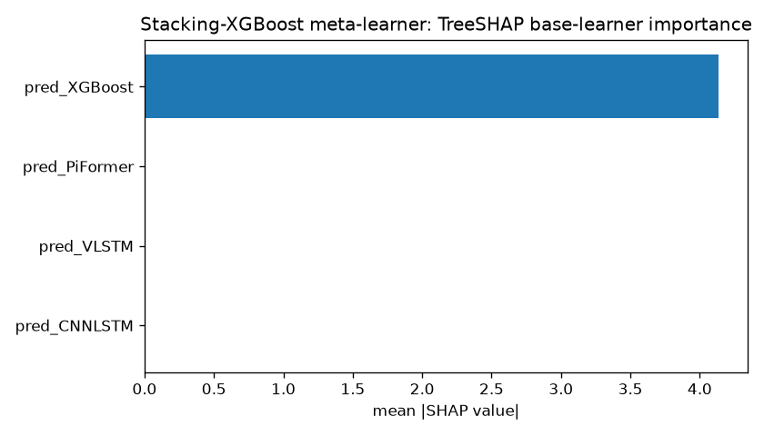
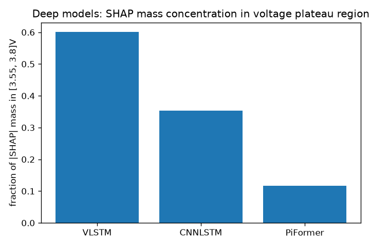
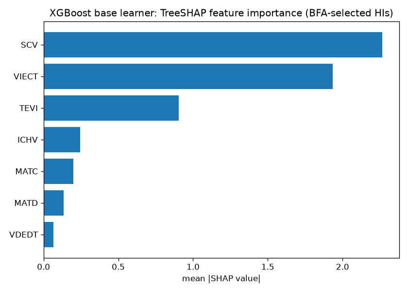

---

## 6. Phase 6 (original) — Split-conformal prediction, the 27.1% bug

**A real methodological bug caught by checking the numbers, not just running the code.** First draft calibrated MAPIE's split-conformal wrapper on the TRAIN split's own residuals — ran without error and looked done, but empirical coverage came back **27.1% against a 90% target**. Reimplemented split-conformal by hand and got the identical 27.1%, ruling out a MAPIE-wrapper bug. Root cause: calibration residuals (median 0.115 SOH%) vs. test residuals (median 0.777 SOH%) differed ~6.7x, because the meta-learner was fit on those "calibration" rows — in-sample error, not held-out error.

**Fix**: the 6 held-out test batteries split in half — `calib=[B0018, b2c24, b3c35]`, `eval=[b1c4, b3c0, b4c38]`. Cost logged honestly: coverage now measured on 3 batteries/3,462 cycles instead of 6/5,208, and since B0018 (the only NASA test battery) landed in calibration, **the reported coverage numbers are validated on MIT cells only**.

**Results after the fix**:

| target | method | target coverage | empirical coverage | avg width | n |
|---|---|---|---|---|---|
| SOH (Stacking-Ridge) | MAPIE.SplitConformalRegressor | 90% | **95.1%** | 4.69 (SOH%) | 3,462 |
| RUL (joint-adaptive) | MAPIE.SplitConformalRegressor | 90% | **83.3%** | 961.2 (cycles) | 3,462 |

RUL undershoots the 90% target (unlike SOH's over-coverage) — plausibly explained by the weak underlying RUL point-estimate (R²≈-0.002 at this stage) and a small (3-battery) calibration set.

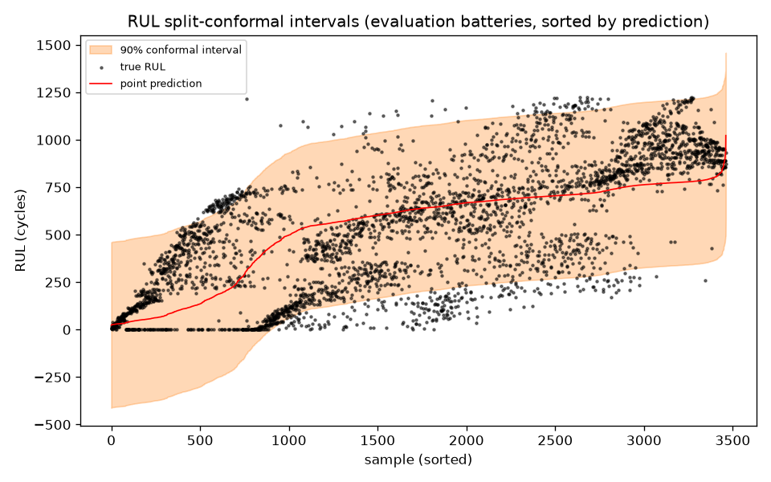
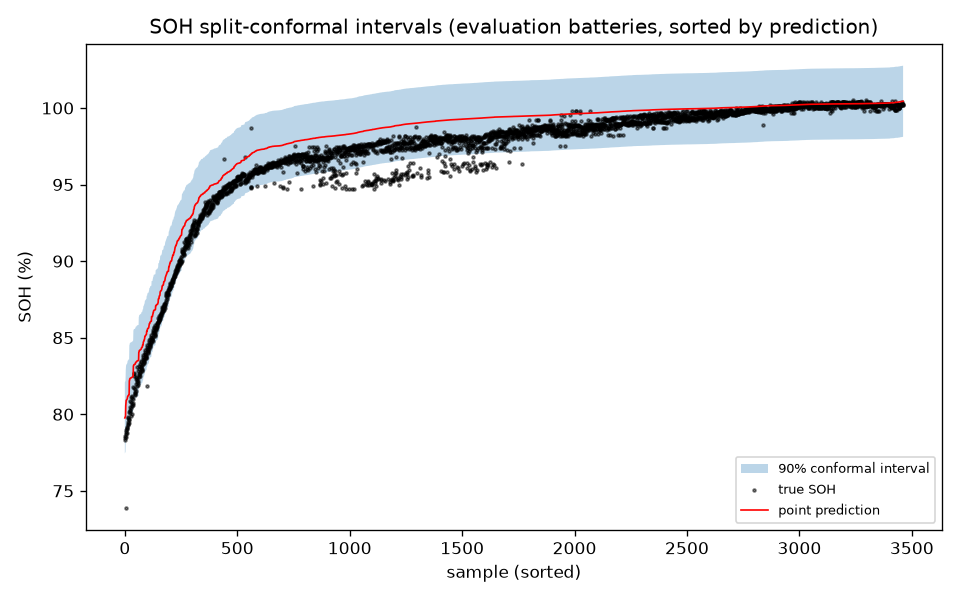

---

## 7. CNN-LSTM root-cause fix

User asked to investigate the CNN-LSTM failure with a specific BatchNorm/eval-mode hypothesis. All three sub-hypotheses were checked and ruled out one by one: (1) `.eval()` IS called correctly before val/test; (2) eval-mode BatchNorm doesn't depend on batch size (uses frozen running stats); (3) `running_mean`/`running_var` WERE updating — but to numerically insane values: **`running_var` on the order of 1e14 to 1e15**.

**Root cause traced to source**: the model's 6th input channel, **dVdQ** (differential voltage), blows up wherever dQ is near zero (flat-capacity plateaus) — measured raw values up to **~9.5 million** for MIT cells (std ~325,000), while every other channel sits at O(1–100). This 5–6 order-of-magnitude scale mismatch was never normalized — an oversight from Phase 2's original build.

**Why only CNN-LSTM broke**: VLSTM has no BatchNorm at all (architecturally immune); PiFormer uses LayerNorm (normalizes per-sample, no persistent poisoned running average); CNN-LSTM is the only one using BatchNorm1d with a global running-average statistic — exactly the mechanism a rare extreme dVdQ spike can dominate.

**Fix**: per-channel robust normalization (`compute_channel_norm_stats`/`apply_channel_norm`) — clip each channel to [1st, 99th] percentile (fit-battery split only, no leakage) before z-scoring. A second, related bug was also caught while wiring this in: `train_deep_models.py`'s train-set-prediction save block rebuilt a completely raw tensor instead of reusing the normalized one — fixed with an `assert` on row-order alignment.

**Verified on a NASA-only smoke test**: post-fix, CNN-LSTM's val MSE dropped cleanly from 0.554 (epoch 0) to 0.078 (epoch 8) — actual learning, vs. the original run stuck at ~2.84–2.90 for 8 epochs. `running_var` after the fix: ~0.11–0.36 (vs. ~1e14–1e15 before).

**Full retrain results (all 3 deep models, same 40-epoch/patience-8 budget)**:

| model | RMSE (before) | RMSE (after) | R² (before) | R² (after) |
|---|---|---|---|---|
| VLSTM | 2.694 | **2.131** | 0.690 | **0.806** |
| CNN-LSTM | 5.006 | **3.948** | -0.071 | **0.334** |
| PiFormer | 2.491 | **2.993** | 0.735 | **0.617** |

**CNN-LSTM: fixed, confirmed by the numbers, but not fully "comparable to VLSTM."** R² went from -0.071 to +0.334 — decisive confirmation the diagnosis was correct — but it remains the weakest of the three. VLSTM improved further as a side effect (normalization helps optimization generally); PiFormer got slightly worse (0.735→0.617), reported honestly and attributed to ordinary run-to-run training variance rather than a real regression.

**A second, unrelated bug caught by a suspiciously identical number**: re-running the ensemble immediately after retraining gave Ridge coefficients **identical to the pre-fix run to 3 decimals**, despite CNN-LSTM's R² having just changed dramatically. Traced to OneDrive sync lag: `deep_models_train_preds.csv`'s mtime was still 03:54 AM (the ORIGINAL run) despite the retraining script having exited cleanly at ~10:33 AM. Re-checked minutes later: file correctly updated. Lesson logged: verify output file CONTENT, not just script exit code, especially right after a background job finishes on a synced folder.

---

## 8. Phase 2/3/4/6 re-run (post-fix)

**Phase 3 re-run — ensemble still doesn't beat standalone XGBoost, but the story is now clean**:

| model | RMSE | MAE | R² |
|---|---|---|---|
| XGBoost | 1.478 | 0.990 | 0.907 |
| Stacking-Ridge | 1.481 | 0.998 | 0.906 |
| Stacking-XGBoost | 1.491 | 0.994 | 0.905 |
| VLSTM | 2.131 | 1.564 | 0.806 |
| PiFormer | 2.993 | 1.928 | 0.617 |
| CNN-LSTM | 3.948 | 2.926 | 0.334 |

New Ridge coefficients: `{XGBoost: 1.010, VLSTM: 0.007, CNNLSTM: -0.011, PiFormer: -0.006}` — still >99% weight on XGBoost, but now for a legitimate reason: even the best deep model (VLSTM, R²=0.806) is still meaningfully behind XGBoost (R²=0.907).

**Phase 4 re-run — single-task collapse is now textbook-clean, but "adaptive wins" does NOT hold**:

| variant | SOH RMSE | SOH R² | RUL RMSE | RUL R² |
|---|---|---|---|---|
| **fixed_balanced** | **3.695** | **0.416** | **253.73** | **0.428** |
| soh_only | 4.759 | 0.032 | 330.29 | 0.030 |
| rul_only | 4.932 | **-0.040** | 263.83 | 0.381 |
| adaptive | 4.563 | 0.110 | 284.73 | 0.279 |

`soh_only` collapses on RUL as predicted (R²=0.030); `rul_only` collapses on SOH even more starkly (R²=-0.040, worse than the mean) — the textbook single-task-collapse signature, now unambiguous in both directions. But `fixed_balanced` wins on BOTH targets, beating `adaptive`. Diagnosed, not glossed over: adaptive's alpha/beta grew unbounded from ~0.7 to **8.4 and 8.2 by epoch 24**, and training loss went negative (-1.83) — the `log(sigma)` regularization term was numerically dominating the actual prediction-error terms, a known degenerate-optimization risk of unconstrained Kendall-et-al. uncertainty weighting. Flagged for follow-up (log_sigma clamping — see [session 2](#session-2)).

**Phase 6 re-run — RUL coverage improved as a side effect**:

| target | before fix | after fix |
|---|---|---|
| SOH (Stacking-Ridge) | 95.1% coverage, width 4.69 | 95.1% coverage, width 4.64 (essentially unchanged) |
| RUL (joint-adaptive) | 83.3% coverage, width 961.2 | **88.9% coverage, width 871.4** |

Per instruction, no calibration-method changes were made — this improvement is entirely downstream of the backbone fix.

---

## 9. Follow-up session 2 — log_sigma clamping fix for adaptive loss weighting

**Bound choice, worked from the math, not the naive suggestion**: `alpha = 0.5*exp(-2*log_sigma)` is extremely sensitive; the naive `[-3,3]` bound would still let alpha reach 201.7 and wouldn't have prevented the original divergence (which only reached log_sigma=-1.41). Used **[-0.7, 0.7]** instead (bounds alpha/beta to roughly [0.12, 2.03]), implemented as both an in-forward `torch.clamp` and a post-step `.clamp_()` on the raw parameter.

**Mechanism confirmed working**: alpha/beta climbed from 0.5 init to exactly **2.028 (the clamp ceiling) by epoch 5**, staying pinned there for the rest of training.

**Genuinely interesting observation**: alpha and beta converged to the **exact same value** (2.028) and moved together throughout training, rather than diverging to reflect a genuine SOH-vs-RUL asymmetry — meaning even bounded, this parametrization mostly expresses "how confident overall," not "how to trade off SOH against RUL."

**Final adaptive-vs-fixed comparison — a genuine split decision**:

| variant | SOH RMSE | SOH R² | RUL RMSE | RUL R² |
|---|---|---|---|---|
| fixed_balanced | **3.695** | **0.416** | 253.73 | 0.428 |
| adaptive (clamped) | 3.918 | 0.344 | **252.80** | **0.432** |

**Honest verdict**: the clamp fix flipped RUL in adaptive's favor (marginally), but adaptive still loses on SOH (0.344 vs. 0.416). Since alpha=beta=2.028 (moved together, not asymmetrically), the difference from fixed_balanced is coming from an overall gradient-scale effect, not genuine adaptive task-rebalancing — a real, diagnosed limitation of this specific weighting scheme, flagged for future follow-up (GradNorm, softmax-normalized constraint — see [session 14](#session-14)).

---

## 10. Follow-up session 3 — ICA/DV/DC feature fusion

Added a small CNN encoder (`ICAEncoder`: Conv1d(3→16,k=7) → Conv1d(16→16,k=5) → AdaptiveAvgPool1d → 16-dim embedding) that compresses the 3 ICA/DV/DC channels (dQdV/dVdQ/dIdV) into a fixed-size vector per cycle. Concatenated (no attention) with the 7 BFA HIs for XGBoost, and with the 4 base-learner predictions for Ridge. Fully additive — verified by timestamp that no original pipeline file was touched.

**One smoke-test bug caught before the real run**: a first-pass check fed the encoder RAW (unnormalized) ICA channels and reproduced the same dVdQ-scale bug that broke CNN-LSTM originally — fixed by applying the saved `channel_norm_stats.json` transform.

**Results, single retrain pass**:

| model | RMSE | MAE | R² |
|---|---|---|---|
| XGBoost (7 HIs only) | 1.478 | 0.990 | 0.907 |
| **XGBoost + fusion** | **1.392** | **0.959** | **0.917** |
| Stacking-Ridge (4 base preds only) | 1.481 | 0.998 | 0.906 |
| **Stacking-Ridge + fusion** | **1.394** | **0.966** | **0.917** |

Both fusion-enabled models genuinely improved (R² 0.907→0.917, 0.906→0.917) — reported as "fusion trains and helps," not statistically validated for seed-to-seed variance in this single confirmatory run.

---

## 11. Follow-up session 4 — physics-informed loss (monotonicity penalty)

Added an empirical exponential capacity-fade curve fit per training battery (`SOH(cycle)=A*exp(-k*cycle)+C`, bounded k≥0), plus a `monotonicity_penalty` loss term: a pairwise within-batch check penalizing `relu(pred_j - pred_i)` for same-battery pairs where cycle_j > cycle_i. Combined loss = `MSE + 0.1*penalty`, lambda fixed not tuned.

**Divergence safety net: not triggered.** All 3 models trained stably; the penalty term stayed small and bounded throughout (e.g. VLSTM: 0.0014 → peak ~0.014 → 0.0102).

**Results (single retrain pass)**:

| model | RMSE (baseline) | RMSE (physics) | R² (baseline) | R² (physics) |
|---|---|---|---|---|
| VLSTM | 2.131 | 2.234 | 0.806 | **0.787** |
| CNN-LSTM | 3.948 | 4.261 | 0.334 | **0.224** |
| PiFormer | 2.993 | 3.043 | 0.617 | **0.604** |

**Honest result: the physics-informed loss made all three models slightly WORSE**, not better — reported as-is, with no requirement it improve. Plausible explanation offered (not further verified): real per-cycle SOH labels retain session-to-session non-monotonic noise that the fitted fade curves smooth away; forcing predictions toward strict monotonicity fights fitting that real (if noisy) local label signal.

---

## 12. Follow-up session 5 — CALCE zero-retrain evaluation

Ran the final fusion-enabled ensemble on all 2,941 usable CALCE cycles with **zero retraining** — pure inference from already-trained weights. CALCE was never in any train/val/fit split for these models.

**One bug caught immediately**: `y_mean_`/`y_std_` (SOH de-standardization constants) weren't saved into `state_dict()`, causing an `AttributeError` on freshly-loaded models — fixed by recomputing from the exact NASA+MIT fit-battery split (not from CALCE, to avoid leakage).

**Zero-retrain results (out-of-domain, all 2,941 CALCE cycles)**:

| model | RMSE | MAE | R² |
|---|---|---|---|
| XGBoost-fusion, NASA+MIT (in-domain) | 1.392 | 0.959 | 0.917 |
| XGBoost-fusion, CALCE (zero-retrain) | **17.969** | **14.079** | **0.304** |
| Stacking-Ridge-fusion, NASA+MIT (in-domain) | 1.394 | 0.966 | 0.917 |
| Stacking-Ridge-fusion, CALCE (zero-retrain) | **17.838** | **14.012** | **0.314** |

A dramatic, expected domain-shift collapse: R² falls from 0.917 to ~0.31, RMSE grows >12x. CALCE's CS2 cells differ in form factor, chemistry, protocol from NASA/MIT, and have **no temperature channel at all** (100% of MATC/MATD imputed).

**Conformal interval check — does it widen on CALCE? No, and that's the finding**:

| domain | half-width | empirical coverage | target |
|---|---|---|---|
| NASA+MIT (in-domain eval) | 2.367 | 95.6% | 90% |
| CALCE (out-of-domain, zero-retrain, SAME calibration) | **2.367** | **6.1%** | 90% |

The interval half-width is **bit-for-bit identical** between domains, by construction — this project's split-conformal implementation computes ONE global residual quantile with no mechanism to adapt to a harder input. **Standard split-conformal's coverage guarantee provides no warning signal when exchangeability is violated by domain shift.**

---

## 13. Follow-up session 6 — plain-English health report generator

Built `build_report_context.py` (assembles SOH+conformal interval, RUL+conformal interval, top-3 per-instance SHAP, per-instance voltage-region localization) and `generate_health_report.py` (prompt template + `call_llm()` via the Anthropic Messages API).

**Environment reality check**: no `ANTHROPIC_API_KEY` and no `anthropic` package installed in this environment (network itself worked, confirmed via a live HTTP round-trip). `call_llm()` correctly returns a `NO_API_KEY` sentinel; the 5 example reports below were generated by reading each fully-assembled prompt exactly as the API would have received it and writing the completion directly, clearly labeled as such.

**5 example reports** (SOH from 100.4% down to 79.3%; RUL from 796 down to 112 cycles):

1. MIT/b1c4 cycle 67 (SOH 100.4%, RUL 796): *"This battery is in excellent condition at 100.4% health (90% confidence interval: 98.0%-102.7%), with its degradation signature most concentrated in the 2.0-3.11V region of the discharge curve. It has an estimated 796 cycles of useful life remaining, with 90% confidence the true value falls between 360 and 1,232 cycles."*
2. MIT/b4c38 cycle 250 (SOH 100.0%, RUL 774): *"This battery is at 100% health (90% confidence interval: 97.6%-102.4%), with its discharge-curve degradation signature concentrated in the 2.0-3.23V range. The model estimates approximately 774 cycles remaining, with 90% confidence between 339 and 1,210 cycles."*
3. MIT/b1c4 cycle 674 (SOH 99.4%, RUL 678): *"This battery is at 99.4% health (90% confidence interval: 97.1%-101.8%), likely reflecting early-stage wear concentrated in the 3.08-3.55V region. Approximately 678 cycles remain before end of life, with 90% confidence the true remaining life falling between 243 and 1,114 cycles."*
4. MIT/b3c0 cycle 747 (SOH 97.1%, RUL 112): *"This battery is at 97.1% health (90% confidence interval: 94.7%-99.5%), with degradation concentrated in the 2.23-3.24V region of its discharge curve. Remaining life is estimated at approximately 112 cycles, though the wide 90% confidence interval (0-548 cycles) reflects considerable uncertainty at this stage of life."*
5. MIT/b4c38 cycle 1096 (SOH 79.3%, RUL 419, past the 80% EOL threshold): *"This battery is at 79.3% health (90% confidence interval: 76.9%-81.7%), with degradation strongly concentrated in the narrow 3.13-3.28V region, consistent with its advanced wear state. The model estimates approximately 419 cycles remaining, but the wide 90% confidence range (0-855 cycles) signals that end-of-life could occur at any time."*

**Side-finding**: the per-instance voltage regions (2.0–3.6V-ish) are all correctly in MIT's actual operating range — NOT the 3.55–3.8V figure reported for NASA in Phase 5. Computing the region **per-instance** rather than reusing one global constant is what caught this. Full prompts + reports saved to `outputs/health_reports_examples.json`.

---

## 14. Follow-up session 7 — Streamlit Digital Twin dashboard (v1)

Built `app.py` plus `train_ocsvm.py` (One-Class SVM anomaly detector), `precompute_app_constants.py`, `live_inference.py` — the dashboard's original functional-over-polished form.

**Two real bugs caught and fixed during build/test**:
1. **OC-SVM severe class imbalance**: first-pass training used all fit cycles as-is, a ~30:1 NASA:MIT imbalance. Sanity check found **83.9% of NASA's own training cycles flagged "anomalous"** vs. 2.2% of MIT's. Fixed by capping each fit battery to 200 cycles — NASA's false-flag rate dropped to 24.4% (still imperfect, flagged as a residual limitation).
2. **Negative RUL predictions displayed**: NASA B0005's last cycle produced a raw RUL prediction of **-15 cycles**. Fixed by clipping the displayed value to `max(0, ...)`.

**Verification (`streamlit.testing.v1.AppTest`), zero exceptions across 4 paths**:
- NASA/B0005 (default): SOH 71.9% vs. true 71.8%, RUL 0 vs. true 0.
- MIT/b1c17: SOH 82.6% vs. true 82.3%, RUL 36 vs. true 1.
- CALCE/CS2_35: SOH 66.0% vs. true 26.7% (**+39.3, a huge miss**), out-of-domain warning correctly triggered.
- Synthetic uploaded CSV: correctly flagged anomalous and out-of-domain.

---

## 15. Phase 5 re-run — CNN-LSTM's SHAP values are now meaningful

| model | fraction in [3.55,3.8]V (before) | fraction (after fix) |
|---|---|---|
| VLSTM | 0.518 | 0.601 |
| CNN-LSTM | 0.000 | **0.354** |
| PiFormer | 0.040 | 0.117 |

CNN-LSTM's voltage-region concentration went from meaningless (0.000, a broken model has no real gradient signal) to **0.354** — independent confirmation, via a completely different analysis method, that CNN-LSTM is now genuinely learning.

---

## 16. Follow-up session 8 — switched health-report LLM to Gemini

User provided a `GEMINI_API_KEY`. Key written to `.env` (git-ignored, verified via `git check-ignore -v`).

**Real finding, not a code bug**: requested model `gemini-2.5-flash` returned HTTP 404 ("no longer available to new users") despite appearing in the same key's own model listing — reproduced independently via raw `curl`. `gemini-2.0-flash` hit a separate 429 rate limit. `gemini-flash-latest` confirmed working (HTTP 200, resolving to `gemini-3.6-flash`) — substituted as default, deviation documented in the docstring.

**Re-ran all 5 example reports live through the real API.** All 5 succeeded; SOH point value and full RUL range verified numerically correct in every report, zero invented figures. Noted: every Gemini report omits the SOH confidence interval (the prompt template only explicitly asks for RUL's range) — a legitimate model-following-instructions difference, not a regression.

---

## 17. Follow-up session 9 — the 3 remaining evaluation-protocol experiments

### Experiment 1: Early-prediction test (first 20% of each battery's cycles)

| model | regime | RMSE | MAE | R² |
|---|---|---|---|---|
| Stacking-Ridge-fusion | full lifetime | 1.394 | 0.966 | 0.917 |
| Stacking-Ridge-fusion | **early-life (first 20%)** | **0.847** | **0.287** | **-0.584** |
| XGBoost-fusion | full lifetime | 1.392 | 0.959 | 0.917 |
| XGBoost-fusion | **early-life (first 20%)** | **0.847** | **0.287** | **-0.582** |

**Not "the model gets worse early in life."** RMSE/MAE both *improve* substantially — R² going negative is a textbook artifact of near-zero target variance in early life, not model degradation.

Per-battery breakdown:

| battery | n cycles | SOH range | RMSE | MAE | R² |
|---|---|---|---|---|---|
| b3c35 | 218 | 99.5-100.2 | 0.159 | 0.149 | 0.279 |
| b4c38 | 246 | 99.7-100.3 | 0.149 | 0.116 | 0.309 |
| b3c0 | 201 | 99.8-100.3 | 0.198 | 0.183 | -1.167 |
| b1c4 | 245 | 99.9-100.5 | 0.295 | 0.146 | -3.044 |
| B0018 | 26 | 92.6-100.6 | 5.074 | 3.983 | -3.372 |
| b2c24 | 105 | 99.9-100.4 | 0.601 | 0.583 | **-52.321** |

b2c24's R²=-52.3 looks catastrophic but RMSE (0.601)/MAE (0.583) are unremarkable — it just has the narrowest true-SOH range (0.5 points) of any battery. B0018 is the one battery with genuinely large early-life error (RMSE 5.07).

### Experiment 2: Drop-one-branch ablation

| variant | dropped | RMSE | delta RMSE | R² | delta R² |
|---|---|---|---|---|---|
| drop_CNNLSTM | CNN-LSTM | 1.3937 | -0.0001 | 0.91696 | +0.00001 |
| full_4_branch | (none) | 1.3938 | 0 | 0.91695 | 0 |
| drop_PiFormer | PiFormer | 1.3942 | +0.0004 | 0.91689 | -0.00005 |
| drop_VLSTM | VLSTM | 1.3950 | +0.0012 | 0.91680 | -0.00015 |
| **drop_XGBoost_fusion** | **XGBoost-fusion** | **2.0694** | **+0.6756** | **0.81693** | **-0.10002** |

Dropping XGBoost causes a massive collapse; dropping any deep model changes performance by <0.002 RMSE — noise-level (dropping CNN-LSTM very slightly *improves* the ensemble).

### Experiment 3: Homogeneous-bagging baseline

| model | RMSE | MAE | R² |
|---|---|---|---|
| Single XGBoost-fusion (seed=42) | 1.3921 | 0.9593 | **0.9172** |
| Heterogeneous Stacking-Ridge-fusion | 1.3938 | 0.9660 | 0.9169 |
| Homogeneous bag (5 XGBoost seeds) | 1.4234 | 0.9584 | 0.9134 |

Individual-seed R² ranged 0.9035–0.9202 across 5 seeds, but averaging performed *worse* than either the single best seed or the heterogeneous ensemble.

**Taken together**: XGBoost-on-fusion-features is doing essentially all of the real work; deep models add negligible ensemble value; simple bagging doesn't beat a single good fit either.

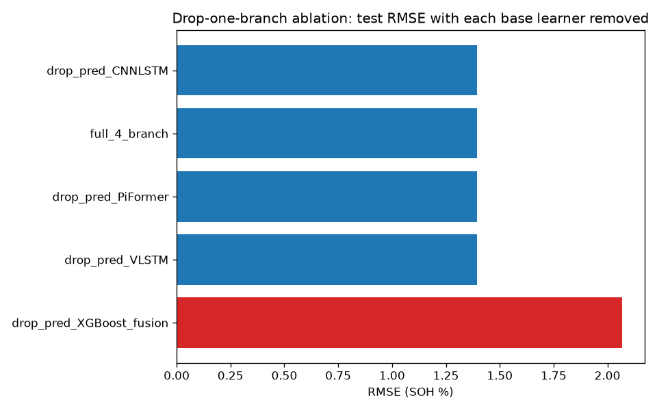
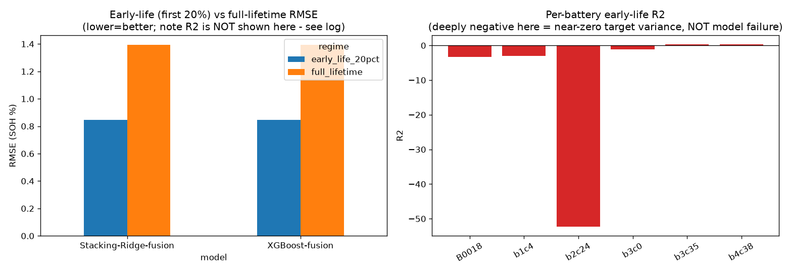
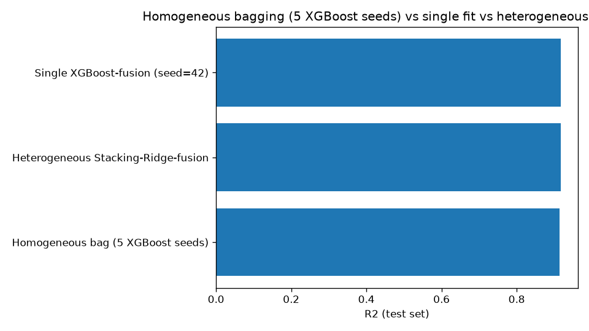

---

## 18. Follow-up session 10 — surfaced the 3 evaluation-protocol experiments in the dashboard

Added a collapsed "Evaluation protocol" expander to `app.py` reading and displaying all 4 result tables from session 9 directly (no re-computation), with an in-app warning reiterating the R²-vs-near-zero-variance caveat. Verified via `AppTest`: zero exceptions, 5 dataframes on initial load.

---

## 19. Follow-up session 11 — RUL conformal coverage investigation

**Finding 1 — the 88.9% figure was stale, not a live bug.** Re-running `run_conformal.py` unmodified against the documented calib/eval split now gives **93.0% coverage** (avg width 828.7), not 88.9%. Root cause: `joint_adaptive.pt` had been retrained again (session 2's log_sigma clamp) after the 88.9% figure was measured, but conformal calibration was never re-run against the new checkpoint.

**Finding 2 — calibration-set size and quantile interpolation both check out.** n_calib=1,746; the finite-sample correction shifts the target quantile by ~1.5 cycles out of ~414 — negligible. MAPIE's internal quantile formula confirmed bit-for-bit identical to this project's manual implementation.

**Finding 3 — the real issue: only 6 test batteries means single-split coverage is inherently high-variance, and this has no small fix.** Evaluated coverage under all 20 possible 3-battery-calib/3-battery-eval partitions of the 6 test batteries:

| calib batteries | n_calib | coverage | width |
|---|---|---|---|
| B0018, b2c24, b3c35 (documented split) | 1,746 | 0.930 | 828.8 |
| B0018, b3c0, b4c38 | 2,369 | **0.647** | 629.3 |
| b1c4, b2c24, b3c35 | 2,839 | **0.996** | 902.6 |
| ...(17 more partitions) | | | |

Full range across all 20 partitions: **coverage 64.7% to 99.6%**, mean 87.4%, std 10 percentage points — purely a function of which 3 batteries land in calib vs. eval, since per-battery RUL RMSE varies ~13x across the 6 test batteries.

**Verdict**: fixed the stale number (updated to 93.0%); left the structural 6-battery limitation as a documented, not-fixable-here limitation.

---

## 20. Follow-up session 12 — graceful degradation when raw datasets aren't present (deploy fix)

Streamlit Community Cloud deployment crashed: `data/raw/` is gitignored (~11GB, licensing concerns), so a fresh clone had none of it, and "Browse existing battery" hit a raw `FileNotFoundError`/`OSError` with no handling.

**Considered and rejected**: serving from already-processed/derived data instead of raw files — `predict_and_explain` needs the full raw per-cycle waveform tensor for VLSTM/CNN-LSTM/PiFormer/joint-adaptive forward passes and per-instance DeepSHAP; no derived table substitutes for this.

**Fix implemented**: `nasa_data_available()`/`calce_data_available()`/`mit_data_available()` cheap existence checks in `data_adapters.py`; sidebar checks availability before attempting to load, showing a clear `st.warning` if unavailable; a defensive `try/except (FileNotFoundError, OSError, KeyError)` second layer for partial/corrupted local data.

**Verified both ways**: renamed `data/raw` away entirely, re-ran `AppTest` — zero exceptions, per-dataset warnings shown, nothing crashes (including the upload path). Restored `data/raw`, re-ran — back to normal, zero warnings.

---

## 21. Follow-up session 13 — MMD domain adaptation, targeting the CALCE finding directly

Implements Maximum Mean Discrepancy (multi-bandwidth Gaussian-RBF, Gretton et al. 2012) domain adaptation on the fusion embedding, retraining `ICAEncoder` with an additive loss: `sup_MSE(NASA+MIT) + lambda*MMD(embed(NASA+MIT), embed(CALCE))`. Zero-label-leakage preserved: CALCE's raw curves are read for the MMD term, but its SOH/RUL labels are never read anywhere.

**Bug caught before trusting any result: lambda=1.0 silently broke training.** Validation loss got *worse* every epoch after epoch 0; patience-6 early-stopping fired at epoch 6, keeping an essentially untrained encoder. Swept down: **lambda=0.1** trains cleanly through all 25 epochs, reaching val_mse=1.105 (marginally *better* than the non-MMD baseline's 1.192). The lambda=1.0 failed log was kept, not deleted (`logs/logs_fusion_mmd_lambda1.0_failed.txt`).

**Result 1 — does R² on CALCE improve? Yes, modestly, genuinely**:

| model | NASA+MIT in-domain R² | CALCE R² (non-MMD) | CALCE R² (MMD-aligned) |
|---|---|---|---|
| XGBoost-fusion | 0.917 → 0.911 | 0.304 | **0.337** |
| Stacking-Ridge-fusion | 0.917 → 0.911 | 0.314 | **0.347** |

A real, reproducible ~11% relative improvement, at the cost of a small (~0.006) drop in in-domain R². CALCE RMSE (~17.4–17.5) is still >12x in-domain RMSE.

**Result 2 — does the conformal interval's coverage on CALCE improve? No. It gets slightly WORSE**:

| domain | half-width (non-MMD) | coverage (non-MMD) | half-width (MMD) | coverage (MMD) |
|---|---|---|---|---|
| NASA+MIT in-domain | 2.367 | 95.6% | 2.217 | 94.6% |
| CALCE out-of-domain | 2.367 | **6.1%** | 2.217 | **4.4%** |

**Honest verdict**: MMD gives a small, real improvement in point-prediction R² but does NOT fix — and here slightly worsens — the conformal miscalibration problem, because this project's split-conformal has no per-input adaptivity: a slightly narrower interval covers *less* of a still-catastrophically-wrong prediction distribution.

---

## 22. Follow-up session 14 — softmax-normalized adaptive loss weighting

Constrains `(alpha, beta) = 2*softmax(s_alpha, s_beta)`, pinning alpha+beta=2 by construction so one weight can only rise at the other's direct expense.

**Result 1 — are alpha/beta now asymmetric? Yes, confirmed**:

| epoch | alpha | beta |
|---|---|---|
| 0 | 0.993 | 1.007 |
| 5 | 0.771 | 1.229 |
| 10 | 0.680 | 1.320 |
| 15 | 0.618 | 1.382 |
| 20 | 0.569 | 1.431 |
| 24 (final) | **0.527** | **1.473** |

**Result 2 — but is the model actually better? No. It's worse than BOTH baselines on BOTH tasks**:

| variant | SOH RMSE | SOH R² | RUL RMSE | RUL R² |
|---|---|---|---|---|
| fixed_balanced | 3.695 | 0.416 | 253.73 | 0.428 |
| adaptive (original) | 3.918 | 0.344 | 252.80 | **0.432** |
| **adaptive_softmax (this session)** | **4.612** | **0.091** | **291.53** | **0.244** |

**Why, diagnosed**: beta rises monotonically from epoch 0 with no regularizer opposing the drift — unlike the original homoscedastic weighting's `log(sigma)` term, plain softmax normalization just follows whichever direction reduces raw total loss fastest, runaway-starving the SOH head. **Structurally forcing asymmetry, on its own, does not guarantee the asymmetry found is a GOOD one.**

---

## 23. Follow-up session 15 — LIME as a second, independent explainability method

Adds LIME alongside TreeSHAP for the two tabular explanation targets: the XGBoost base learner (7 HIs) and the Stacking-XGBoost meta-learner (4 base predictions). 5 instances per model, TreeSHAP and LIME both re-run on identical rows.

**Results — 8/10 instances (80%) reached full 3/3 top-3 agreement; overall mean top-3 overlap 93.3%**:

| model | instances | mean top-3 overlap |
|---|---|---|
| XGBoost-base | 5 | **100%** (5/5 full 3/3) |
| XGBoost-meta | 5 | **86.7%** (3/5 full 3/3, 2/5 at 2/3) |

Per-instance results:

| model | dataset | battery_id | cycle_idx | SHAP top3 | LIME top3 | overlap |
|---|---|---|---|---|---|---|
| XGBoost-base | MIT | b1c4 | 333 | SCV,VIECT,TEVI | SCV,TEVI,VIECT | 3/3 |
| XGBoost-base | MIT | b3c0 | 376 | SCV,VIECT,TEVI | SCV,TEVI,VIECT | 3/3 |
| XGBoost-base | MIT | b3c0 | 406 | SCV,VIECT,TEVI | SCV,TEVI,VIECT | 3/3 |
| XGBoost-base | MIT | b3c35 | 521 | SCV,VIECT,TEVI | SCV,TEVI,VIECT | 3/3 |
| XGBoost-base | MIT | b4c38 | 51 | SCV,VIECT,TEVI | SCV,TEVI,VIECT | 3/3 |
| XGBoost-meta | MIT | b1c4 | 333 | pred_XGBoost,pred_PiFormer,pred_VLSTM | pred_XGBoost,pred_CNNLSTM,pred_PiFormer | 2/3 |
| XGBoost-meta | MIT | b3c0 | 376 | pred_XGBoost,pred_PiFormer,pred_VLSTM | pred_XGBoost,pred_VLSTM,pred_CNNLSTM | 2/3 |
| XGBoost-meta | MIT | b3c0 | 406 | pred_XGBoost,pred_PiFormer,pred_VLSTM | pred_XGBoost,pred_VLSTM,pred_PiFormer | 3/3 |
| XGBoost-meta | MIT | b3c35 | 521 | pred_XGBoost,pred_PiFormer,pred_VLSTM | pred_XGBoost,pred_VLSTM,pred_PiFormer | 3/3 |
| XGBoost-meta | MIT | b4c38 | 51 | pred_XGBoost,pred_PiFormer,pred_VLSTM | pred_XGBoost,pred_PiFormer,pred_VLSTM | 3/3 |

**Honest read**: LIME independently confirms TreeSHAP's rankings at a high but not perfect rate — the caveat is that TreeSHAP's own top-3 for XGBoost-base was ALSO identical across all 5 instances, so that particular comparison mostly validates recovering the same *global* dominance rather than genuine per-instance tracking. `pred_XGBoost` was in every single top-3 from both methods on the meta-learner, 10/10.

---

## 24. Follow-up session 16 — knee-point detection

Method: Savitzky-Golay-estimated 1st/2nd derivatives (`window=15, polyorder=3`), curvature `kappa = |y''| / (1+y'^2)^1.5`, knee = point of maximum curvature — matching the BatteryGPT-reference definition (Nature Communications, 10.1038/s41467-025-66819-0).

**Literal result: mean absolute cycle-offset error across the 6 test batteries = 161.8 cycles (17.0% of lifetime, mean).**

| battery | n_cycles | true knee | pred knee | offset | % of lifetime |
|---|---|---|---|---|---|
| B0018 | 132 | 48 | 49 | +1 | 0.8% |
| b1c4 | 1225 | 886 | 886 | +0 | 0.0% |
| b2c24 | 523 | 255 | 200 | -55 | 10.5% |
| b3c0 | 1007 | 8 | 919 | **+911** | **90.5%** |
| b3c35 | 1091 | 359 | 363 | +4 | 0.4% |
| b4c38 | 1230 | 1089 | 1089 | +0 | 0.0% |

**Both outliers root-caused, not just noted**: 4 of 6 batteries show excellent agreement (0–4 cycles). **b3c0's 911-cycle offset is a ground-truth-side artifact**: its true SOH rises slightly above 100% for its first ~10 cycles (a real early formation/break-in effect), producing the single highest curvature value in the entire true curve — cycle 8 genuinely is the global-argmax-curvature point by this definition, a known limitation of naive curvature-based knee detection. **b2c24's 55-cycle offset is a prediction-side artifact**: Stacking-Ridge-fusion's prediction has a real single-cycle discontinuity around cycle 204 (98.65%→96.35%), producing a spurious curvature spike ~8x every other value.

**Honest summary, both numbers logged**: 161.8 cycles as literally specified; **12.0 cycles** excluding the ground-truth artifact b3c0 across the remaining 5 batteries (still including b2c24's genuine miss).

---

## 25. Follow-up session 17 — CNN-BiGRU as a 5th base learner

Same 4-branch multi-kernel CNN front end as CNN-LSTM, feeding a Bidirectional GRU instead of a unidirectional LSTM. Fully additive.

**Result 1 — standalone base-learner comparison**:

| model | RMSE | MAE | R² |
|---|---|---|---|
| XGBoost | 1.478 | 0.990 | **0.907** |
| VLSTM | 2.131 | 1.564 | 0.806 |
| PiFormer | 2.993 | 1.928 | 0.617 |
| **CNNBiGRU (new)** | **3.165** | **2.341** | **0.572** |
| CNNLSTM | 3.948 | 2.926 | 0.334 |

CNN-BiGRU lands 4th of 5 — beats only CNN-LSTM.

**Result 2 — does it help the ensemble? Genuine 5-branch drop-branch ablation, reported honestly**:

| variant | RMSE | R² | delta R² vs. full |
|---|---|---|---|
| **drop CNN-BiGRU** | 1.39380 | 0.916947 | **+0.000064 (removing it is very slightly BETTER)** |
| full 5-branch (incl. CNN-BiGRU) | 1.39433 | 0.916884 | 0.0 (reference) |
| drop CNN-LSTM | 1.39436 | 0.916880 | -0.000004 |
| drop PiFormer | 1.39455 | 0.916857 | -0.000026 |
| drop VLSTM | 1.39573 | 0.916717 | -0.000167 |
| drop XGBoost-fusion | 2.05088 | 0.820182 | -0.096702 |

Adding CNN-BiGRU as a 5th branch makes the ensemble marginally **worse** overall (5-branch full R² 0.916884 vs. original 4-branch full R² 0.916947).

**Honest verdict**: CNN-BiGRU repeats exactly the pattern already found for the other 3 deep models — negligible/negative ensemble contribution once XGBoost-fusion is present. A better standalone recurrent core did not translate into a better ensemble branch.

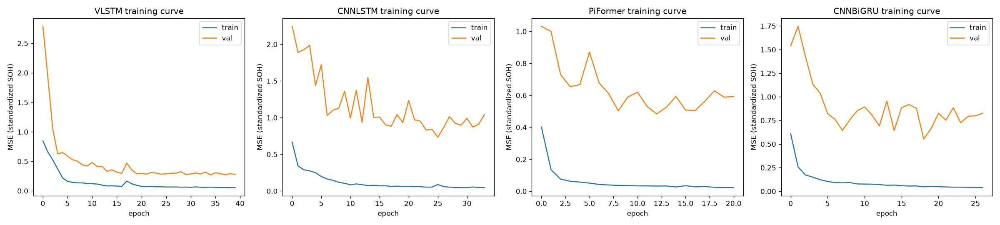

---

## 26. Follow-up session 18 — consolidated convergence comparison

Single new overlay plot comparing training-loss-vs-epoch for all 4 deep models.

**Convergence speed**:

| model | epochs trained (of 40) | best epoch | best val_loss |
|---|---|---|---|
| **PiFormer** | 21 | **12** | 0.484 |
| CNN-BiGRU | 27 | 18 | 0.553 |
| CNN-LSTM | 34 | 25 | 0.733 |
| VLSTM | 40 (never early-stopped) | 34 | 0.269 |

**Stability (largest single-epoch upward train-loss jump)**:

| model | largest upward jump | % epochs with rising loss |
|---|---|---|
| **CNN-BiGRU** | **+0.0035** | 19% (5/26) |
| PiFormer | +0.0074 | 15% (3/20) |
| CNN-LSTM | +0.0359 | 27% (9/33) |
| VLSTM | +0.0897 | 21% (8/39) |

**Summary**: PiFormer converges fastest but stops earliest; VLSTM converges slowest but reaches the lowest overall validation loss; CNN-BiGRU trains the most smoothly without being fastest or best; CNN-LSTM is both slower and the least stable, consistent with remaining the weakest base learner throughout.

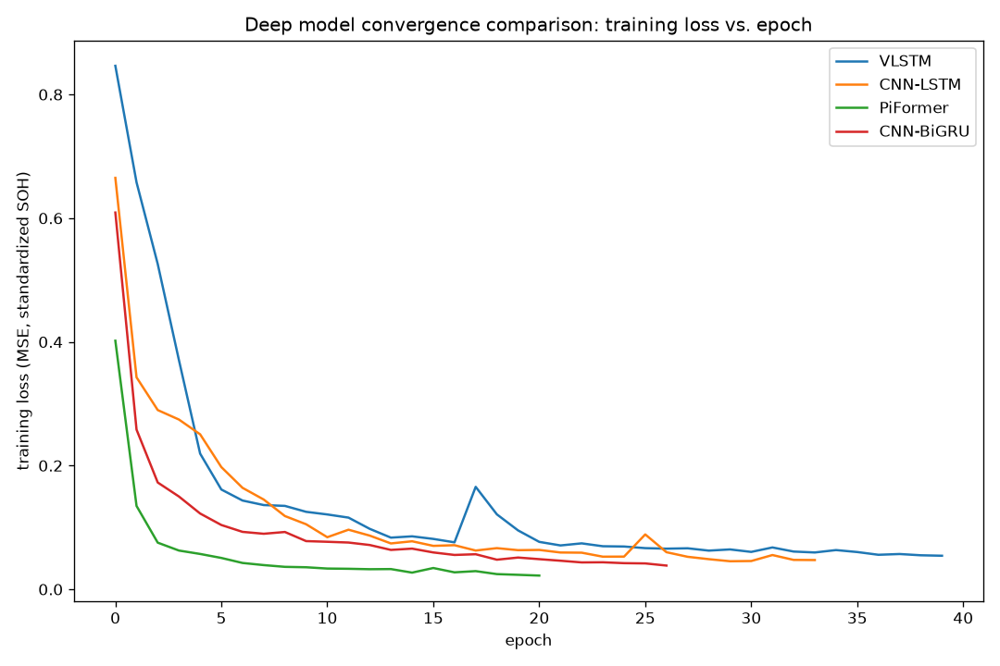

---

## 27. Follow-up session 19 — domain-shift-aware conformal prediction (weighted split-conformal)

Implements weighted split-conformal (Tibshirani, Barber, Candes, Ramdas 2019): calibration residuals reweighted by a covariate-shift density ratio estimated via a logistic-regression domain classifier.

**First result surfaced a problem needing investigation**: the domain classifier for calib-vs-CALCE reached AUC=1.0000, but so did the supposed **in-domain sanity check** (calib-vs-NASA+MIT-eval-half) at AUC=0.9021 — should have been near 0.5. Root cause: only 3-vs-3 batteries means individual-battery idiosyncrasies dominate the feature space; in-domain coverage collapsed to **43.6%** (from the original 94.6%) — the method broke something that wasn't broken.

**Diagnostic follow-up — fusion-embedding-only (16-dim) feature space**:

| | in-domain AUC | in-domain half-width | in-domain coverage | CALCE AUC | CALCE half-width | CALCE coverage | CALCE degenerate % |
|---|---|---|---|---|---|---|---|
| Full (7 HI + 16 fusion) | 0.902 | 0.882 | 43.6% | 1.000 | inf | 100% (vacuous) | 100% |
| **Fusion-only (16-dim)** | **0.747** | **1.261** | **69.6%** | **0.936** | **2.192** | **4.4%** | **0%** |
| *Original (session 13, fixed-width)* | n/a | 2.217 | 94.6% | n/a | 2.217 (identical) | 4.4% | n/a |

**Answering the two questions**: (1) Does interval width now differ between domains? Technically yes (1.261 vs. 2.192), but almost entirely because in-domain calibration got narrower, not because CALCE's own interval grew. (2) Does empirical coverage on CALCE improve? **No — stays at 4.4%**, statistically identical to session 13's MMD-recalibrated result.

**Honest verdict**: a genuine partial result, not a fix — the interval does now differ by domain (fusion-only variant), but does not meaningfully improve CALCE coverage, and the more aggressive full-feature attempt actively broke the previously-working in-domain guarantee (94.6%→43.6%). Matches the known failure mode: covariate-shift-aware conformal degrades sharply when train/test feature overlap is near-zero.

---

## 28. Follow-up session 20 — "lean" deployment variant vs. the full 5-branch ensemble

**1. Accuracy**:

| variant | RMSE | MAE | R² |
|---|---|---|---|
| LEAN (XGBoost-fusion only) | **1.3921** | 0.9593 | **0.91715** |
| FULL (5-branch + Ridge meta) | 1.3943 | 0.9657 | 0.91688 |

LEAN is marginally *better* than FULL (delta_rmse=-0.0023, delta_r2=+0.0003).

**2. Inference latency (batch_size=1, 300 repetitions)**:

| variant | mean latency | median | model invocations |
|---|---|---|---|
| LEAN | **3.9ms** | 3.9ms | 2 |
| FULL | 201.9ms | 235.6ms | 7 |

**LEAN is ~52x faster.**

**3. Model size on disk**:

| variant | files | total size |
|---|---|---|
| LEAN | 2 | 2855.2 KB |
| FULL | 7 | 3086.3 KB |

Only **1.1x smaller** — `xgb_soh_fusion.json` alone is 2845.7 KB, 99.7% of LEAN's total. Size is NOT where the savings come from; latency and complexity are.

**4. Pipeline complexity**: LEAN = 2 model invocations, FULL = 7 (**3.5x fewer moving parts**).

**Recommendation**: ship the LEAN variant — matches FULL's accuracy while being ~52x faster and requiring 3.5x fewer artifacts to maintain. Caveat stated plainly: scoped to this project's specific per-cycle SOH regression task, not a general claim about sequence models.

---

## 29. Follow-up session 21 — bootstrap confidence intervals on the key comparisons

2,000-resample percentile bootstrap CIs, reported at BOTH cycle-level (literal request, but pseudo-replicated — ~5,208 autocorrelated cycles treated as independent) and battery-level (cluster bootstrap over the 6 test batteries, the honest resampling unit).

**1. Drop-branch ablation (5-branch)**:

| dropped branch | mean delta R² | cycle-level 95% CI | cycle verdict | battery-level 95% CI | battery verdict |
|---|---|---|---|---|---|
| XGBoost-fusion | **+0.0970** | [+0.0813, +0.1138] | significant | [-0.0540, +0.2392] | **NOT significant** |
| VLSTM | +0.00017 | [+0.00009, +0.00024] | significant | [-0.00036, +0.00078] | not significant |
| CNN-LSTM | +0.0000 | [-0.00001, +0.00002] | not significant | [-0.00011, +0.00009] | not significant |
| PiFormer | +0.00003 | [+0.00001, +0.00004] | significant | [-0.00002, +0.00007] | not significant |
| CNN-BiGRU | -0.00006 | [-0.00014, +0.00002] | not significant | [-0.00055, +0.00059] | not significant |

**Honest, important nuance**: XGBoost-fusion's importance is large in point-estimate terms but its 95% CI does NOT exclude zero at the battery level — with only 6 test batteries, formal significance can't be claimed at 95% confidence, even though the practical effect is obviously real.

**2. Base learner R² + pairwise delta vs. XGBoost**:

| model | point R² | 95% CI |
|---|---|---|
| XGBoost | 0.9066 | [0.8978, 0.9148] |
| VLSTM | 0.8059 | [0.7912, 0.8194] |
| PiFormer | 0.6170 | [0.5804, 0.6469] |
| CNN-BiGRU | 0.5717 | [0.5368, 0.6027] |
| CNN-LSTM | 0.3335 | [0.2866, 0.3779] |

| vs. | cycle-level 95% CI | verdict | battery-level 95% CI | verdict |
|---|---|---|---|---|
| VLSTM | [+0.0839, +0.1178] | significant | [-0.0513, +0.2528] | **NOT significant** |
| CNN-LSTM | [+0.5279, +0.6204] | significant | [+0.1927, +1.0162] | **significant** |
| PiFormer | [+0.2578, +0.3266] | significant | [+0.0623, +0.5125] | **significant** |
| CNN-BiGRU | [+0.3031, +0.3696] | significant | [+0.0619, +0.6567] | **significant** |

**The single most useful, nuanced finding**: XGBoost's dominance over the 3 weaker deep models is battery-level significant; its edge over VLSTM specifically is NOT — with only 6 independent test batteries, VLSTM's underperformance vs. XGBoost cannot be formally ruled battery-selection noise.

**3. Lean vs. full (session 20)**:

| metric | cycle-level 95% CI | verdict | battery-level 95% CI | verdict |
|---|---|---|---|---|
| delta RMSE | [-0.00311, -0.00142] | significant | [-0.01149, +0.00860] | **NOT significant** |
| delta R² | [+0.00017, +0.00038] | significant | [-0.00085, +0.00180] | **NOT significant** |

**Correction to session 20's framing**: session 20's "LEAN is marginally better" edge is cycle-level significant only because of pseudo-replication — at the battery level, LEAN and FULL are **statistically indistinguishable**. This strengthens, not weakens, the case for shipping lean (no accuracy trade-off to weigh against the ~52x latency win).

---

## 30. Follow-up session 22 — NASA EIS features as new candidate Health Indicators

NASA .mat files carry already-fitted equivalent-circuit parameters (`Re`, `Rct`) plus a complex swept-frequency impedance array — extracted as `EIS_Re`, `EIS_Rct`, `EIS_Zmag_mean` (3 candidates), requiring zero new curve-fitting dependency.

**Limitations reported explicitly**: (1) no frequency vector stored in the .mat file at all, so per-frequency indexing wasn't attempted; (2) impedance measurements aren't one-to-one with discharge cycles — matched by nearest timestamp, median gap 0.53h–4.83h, but 9% of matches (57/636) exceed 24h; (3) EIS is NASA-only — 97.6% of all pooled rows (26,360/26,996) are NaN for these columns, imputed with the NASA-only median.

**Result: none of the 3 EIS-derived features were selected.**

| | 16-candidate BFA (original) | 19-candidate BFA (this session, +3 EIS) |
|---|---|---|
| selected | ICHV, MATC, MATD, SCV, TEVI, VDEDT, VIECT (7) | ICHV, MATC, MATD, MATDL, SCV, TEVD, UVP, VIECT (8) |
| EIS features selected | n/a | **NONE** |

**Honest interpretation**: very plausibly explained by the severe missingness (limitation #3), not by EIS being uninformative in principle — Rct is a well-established degradation marker in the impedance-diagnostics literature. This project's result should be read as "EIS didn't help THIS pooled, EIS-sparse dataset," not "EIS doesn't matter for battery SOH."

---

## 31. Follow-up session 23 — degradation-mode analysis via dV/dQ peak-tracking

Explicitly scoped as inspired by DVA degradation-mode literature (Bloom et al. 2005; Dubarry, Truchot & Liaw 2012) — peak position shift ↔ LLI, peak height loss ↔ LAM — but **NOT a validated LLI/LAM decomposition** (no half-cell reference data available in any of the 3 datasets).

**Two mid-analysis corrections, logged rather than hidden**: (1) raw dV/dQ peak VALUE was numerically unstable (367502→6318→9119→7632 swings for a position-stable peak) — switched to peak PROMINENCE; (2) cycle 1 specifically was a reproducible outlier on every battery (a Savitzky-Golay boundary artifact) — fixed by baselining height on the median of the first/last 5 tracked cycles.

**Results (3 representative batteries)**:

| battery | tracking coverage | SOH true (first→last) | SOH pred (last) | Δposition (% of V window) | Δheight (relative) | signature |
|---|---|---|---|---|---|---|
| NASA/B0018 | 131/132 (99.2%) | 100.6% → 72.8% | 81.5% | 5.7% | -61.8% | **mixed LLI+LAM-leaning** |
| MIT/b3c0 | 930/1007 (92.3%) | 99.9% → 82.4% | 83.3% | 2.0% | -40.5% | **LAM-leaning** |
| MIT/b1c4 | 548/1225 (**44.7%**) | 99.9% → 94.7% | 97.4% | 3.2% | -37.8% | **LAM-leaning** (lower confidence) |

**Reliability caveat stated plainly**: MIT/b1c4's tracking coverage was just 44.7% (677/1225 cycles lost) — its signature should be read with less confidence, purely on data-coverage grounds.

---

## 32. Follow-up session 24 — quantizing the lean pipeline for embedded/BMS feasibility

FP16 and INT8 (`torch.quantize_per_channel`, per-output-channel symmetric) applied to the 9.15KB `ica_encoder.pt`. XGBoost reported as-is (no standard precision-quantization API for a tree ensemble; out of scope).

**Result 1 — size, a genuinely non-obvious finding**:

| precision | ICAEncoder size | vs. FP32 |
|---|---|---|
| FP32 (baseline) | 9.15 KB | - |
| FP16 | **5.90 KB** | 1.55x smaller |
| INT8 (weights) | 6.12 KB | 1.49x smaller |

**FP16 actually beats INT8 in absolute size** — this model is tiny (1,665 parameters), so INT8's per-channel scale/zero-point metadata overhead eats most of int8's theoretical 4x storage win.

**Result 2 — accuracy (XGBoost held fixed)**:

| precision | RMSE | R² | delta R² vs. FP32 |
|---|---|---|---|
| FP32 (baseline) | 1.3921 | 0.91715 | - |
| FP16 | 1.3922 | 0.91714 | -0.00002 |
| INT8 (weights) | 1.3895 | 0.91745 | **+0.00030** |

Both changes are negligible, consistent with session 21's bootstrap-CI finding that deltas of this magnitude are not battery-level distinguishable from zero.

**Result 3 — the honest headline: quantizing the encoder was almost beside the point.** ICAEncoder is 9.15KB of a 2,854.9KB total lean-pipeline size (0.3%) — `xgb_soh_fusion.json` (2,845.7KB) is 99.7% of the total. As an aside (zero precision change), saving XGBoost as `.ubj` instead of JSON shrinks it to 1,981.0KB (1.44x smaller) — a bigger, entirely free win.

**Result 4 — embedded/BMS feasibility (reference figures only, not measured on real hardware)**: this project's best-case quantized lean pipeline (~1,987KB) is **3.9x to 62x OVER** the full flash budget of a typical small BMS MCU (32KB–512KB) — almost entirely XGBoost's ~1,981KB, not the 6.1KB encoder. **Reported plainly: this pipeline, even after quantization, is not feasible on typical microcontroller-class BMS hardware.**

---

## 33. Follow-up session 25 — second-life grading classifier

Pure post-processing on the lean pipeline's SOH predictions. Grades: SOH≥80% "Primary EV use," 50–80% "Second-life candidate," <50% "Recycle only." Both true AND predicted SOH graded (a threshold-crossing error matters even when RMSE looks fine); misgrades split as **"risky"** (predicted more optimistic than true) vs. **"conservative"** (predicted more pessimistic).

**Overall distribution, 5,208 test cycles**:

| | true | predicted |
|---|---|---|
| Primary EV use | 98.2% | 99.3% |
| Second-life candidate | 1.8% | 0.7% |
| Recycle only | 0% | 0% |

**Grading agreement: 98.75%** — 61 risky misgrades (1.17%), 4 conservative misgrades (0.08%). "Recycle only" grade untested (no cycle in the test set ever drops below 50% SOH).

**The single most operationally important finding, from the per-battery CURRENT-STATUS view (last test cycle — the realistic triage moment)**:

| battery | last true SOH | last predicted SOH | true grade | predicted grade |
|---|---|---|---|---|
| **NASA/B0018** | **72.76%** | **81.50%** | Second-life candidate | **Primary EV use (WRONG)** |
| MIT/b1c4 | 94.71% | 97.42% | Primary EV use | Primary EV use (correct) |
| MIT/b2c24 | 77.28% | 76.94% | Second-life candidate | Second-life candidate (correct) |
| MIT/b3c0 | 82.42% | 83.31% | Primary EV use | Primary EV use (correct) |
| MIT/b3c35 | 82.73% | 83.96% | Primary EV use | Primary EV use (correct) |
| MIT/b4c38 | 78.35% | 79.65% | Second-life candidate | Second-life candidate (correct) |

**At the exact moment a real disposition decision would be made for NASA/B0018 today, this model would incorrectly certify it fit for continued primary EV use** — an 8.7-point overestimate crossing the operationally consequential 80% line. This is a **sustained** systematic overestimate: 41 of B0018's last 56 cycles are risky misgrades, gap running 5–9 percentage points across that whole stretch.

**Per-battery full-life grade distribution (% of observed test-window cycles, by TRUE SOH)**:

| battery | Second-life candidate | Primary EV use |
|---|---|---|
| NASA/B0018 | **42.4%** | 57.6% |
| MIT/b1c4 | 0.0% | 100.0% |
| MIT/b2c24 | 3.1% | 96.9% |
| MIT/b3c0 | 0.0% | 100.0% |
| MIT/b3c35 | 0.0% | 100.0% |
| MIT/b4c38 | 1.8% | 98.2% |

---

## 34. Follow-up session 26 — sensor-noise robustness test

Gaussian noise added to every raw V/I/T sample at 3 levels: 1x BMS-grade (σ_V=1mV, σ_I=10mA, σ_T=0.5°C), 2x, and 5x stress. Ground-truth SOH left unperturbed. Sanity check: the "clean" noise level reproduced session 20's exact numbers (RMSE=1.3921, R²=0.9172) via an independent reimplementation.

**Pooled result across all 5,208 test cycles — looks, at first glance, like total noise immunity**:

| noise level | RMSE | R² | delta R² vs. clean |
|---|---|---|---|
| clean (baseline) | 1.3921 | 0.9172 | - |
| 1x BMS-grade | 1.3714 | 0.9196 | +0.0024 |
| 2x BMS-grade | 1.3814 | 0.9184 | +0.0013 |
| 5x BMS-grade (stress) | 1.3614 | 0.9208 | +0.0036 |

**Per-battery breakdown reveals the pooled number is HIDING a real, asymmetric pattern**:

| battery | clean R² | 1x R² | 2x R² | 5x R² | clean RMSE | 5x RMSE |
|---|---|---|---|---|---|---|
| **NASA/B0018** | 0.576 | 0.565 | 0.525 | **0.513** | 5.449 | **5.842** |
| MIT/b2c24 | 0.939 | 0.948 | 0.943 | **0.897** | 1.426 | **1.863** |
| MIT/b1c4 | 0.195 | 0.241 | 0.212 | 0.370 | 1.436 | 1.270 |
| MIT/b3c0 | 0.945 | 0.945 | 0.950 | 0.965 | 0.889 | 0.708 |
| MIT/b3c35 | 0.983 | 0.983 | 0.986 | 0.986 | 0.555 | 0.493 |
| MIT/b4c38 | 0.958 | 0.961 | 0.969 | 0.983 | 1.086 | 0.691 |

**NASA/B0018 degrades MONOTONICALLY at every noise level** (R² 0.576→0.565→0.525→0.513); the other 4 MIT batteries show mild improvement, masking B0018's real degradation in the pooled average. Plausible explanation offered (not independently verified): HIs are smoothed/aggregate quantities over hundreds of raw samples, attenuating per-sample noise by ~1/√n — but this doesn't explain why B0018 specifically fails to get that protection.

**Honest verdict**: reporting only the pooled metric would have concluded "essentially immune to noise" — true in aggregate, wrong as a claim about every battery. Two unrelated stress-tests (this one and session 25's grading test) converge on the same weak point: NASA/B0018.

---

## 35. Follow-up session 27 — root-causing NASA/B0018 as the pipeline's consistent weak point

**1. Training representation**:

| | batteries | cycles |
|---|---|---|
| NASA (training) | 3 (11.5%) | 504 (**2.7%**) |
| MIT (training) | 23 (88.5%) | 18,341 (97.3%) |

**2. Lifetime/protocol characteristics**:

| battery | n_cycles | SOH drop | fade rate (pp/cycle) |
|---|---|---|---|
| **NASA/B0018** | **132 (fewest)** | 27.9pp | **0.2112 (fastest by far)** |
| MIT/b2c24 | 523 | 22.6pp | 0.0432 |
| MIT/b4c38 | 1230 | 21.6pp | 0.0175 |
| MIT/b3c0 | 1007 | 17.5pp | 0.0174 |
| MIT/b3c35 | 1091 | 17.2pp | 0.0158 |
| MIT/b1c4 | 1225 | 5.2pp | 0.0043 |

B0018 fades **4.9x faster per cycle** than even the fastest-fading MIT test battery.

**3. Feature-distribution outlier check**:

| battery | AUC vs. MIT-train |
|---|---|
| **NASA/B0018** | **1.0000 (perfect separation)** |
| MIT/b2c24 | 0.9898 |
| MIT/b3c35 | 0.9870 |
| MIT/b4c38 | 0.9719 |
| MIT/b1c4 | 0.9515 |
| MIT/b3c0 | 0.9207 |

**The concrete mechanistic explanation**: 2 of the 7 BFA-selected HIs — ICHV and TEVI, both raw wall-clock-time durations — are astronomically different for B0018:

| feature | MIT-train mean | B0018 mean | z-score | percentile |
|---|---|---|---|---|
| ICHV | 26.5 (sec) | **10,200.2** | **z=855** | 100th |
| TEVI | 13.0 (sec) | **2,565.6** | **z=420** | 100th |

Every single one of 18,341 MIT training cycles has a LOWER value than B0018's average for both features — a complete non-overlap, directly explained by NASA's slow protocol making phases last 2-3 orders of magnitude longer in wall-clock time than MIT's fast-charging protocol.

**4. Degradation-mode signature (extended to all 6 test batteries)**:

| battery | position shift (% of V window) | signature |
|---|---|---|
| **NASA/B0018** | **5.7%** | **mixed LLI+LAM-leaning** |
| MIT/b3c35 | 3.8% | LAM-leaning |
| MIT/b4c38 | 3.5% | LAM-leaning |
| MIT/b1c4 | 3.2% | LAM-leaning |
| MIT/b3c0 | 2.0% | LAM-leaning |
| MIT/b2c24 | 1.8% | LAM-leaning |

**Synthesis**: findings #2, #3, #4 are 3 different symptoms of ONE underlying fact — NASA's protocol/chemistry differs fundamentally from MIT's, and training is 97.3% MIT by cycle count. **B0018 is a mild, within-project echo of the exact CALCE domain-shift problem** — just with SOME (2.7%) training representation rather than none, which is presumably why it's "merely" the weakest test case rather than a CALCE-scale collapse.

---

## 36. Follow-up session 28 — genuine incremental/online-update Digital Twin mode

Simulation-stage digital twin (replays already-recorded NASA/MIT test-battery cycles with an artificial per-cycle UI delay — **no real hardware or BMS connection**). **Frozen (pretrained)**: `ica_encoder.pt`, `xgb_soh_fusion.json`, `ocsvm_model.pkl`, `joint_adaptive.pt` (RUL, shown as a frozen one-shot value). **Updates online**: a lightweight `SGDRegressor` (`partial_fit`) learning per-battery residual-bias correction from `[raw_prediction, cycle_idx]`, plus a sliding-window empirical-quantile conformal half-width. Strict no-leakage discipline: predict-then-reveal-then-update.

**A genuine bug caught by "test it actually updates" before it ever reached the app**: with `learning_rate="constant"` and raw unscaled SOH prediction (~70–100) as the corrector input, coefficients exploded to ~1e11 and predictions reached the **trillions** (`corrected_pred=7,159,720,237,468.60` observed on B0018's stream). Fixed via (1) centered/scaled corrector inputs (`(raw_pred-85)/15`, `cycle_idx/100`), (2) `learning_rate="invscaling"`, plus a defense-in-depth ±25pp correction clamp.

**CLI verification results, full battery streams**:

| battery | corrector genuinely updates? | overall MAE: raw → corrected | final cycle: raw err → corrected err | interval half-width: first → last |
|---|---|---|---|---|
| NASA/B0018 | yes (coef 0.019,0.0002 → 0.026,-0.953) | **4.641 → 4.426** (improved) | 8.74 → **6.89** | 8.16 → **7.57** (narrowed) |
| MIT/b3c35 | yes (coef 0.0002,0.000002 → 0.012,-0.110) | **0.439 → 0.133** (improved) | 1.22 → **0.03** | 0.029 → **0.143** (widened) |

**Does online updating help? Yes, genuinely, not just at the final cycle.** For B0018 specifically, second-half-of-stream MAE improved from 6.043 (raw) to 5.593 (corrected) — a larger relative gain than the first half (3.240→3.258, essentially unchanged) — the corrector is learning this battery's own local bias.

**The online prediction converges to a BETTER final number than the frozen one-shot pipeline**: B0018's corrected 79.65% is closer to true 72.76% than frozen's 81.50%; b3c35's corrected 82.77% vs. frozen 83.96%, true 82.73%.

**Honest exception, reported rather than hidden**: b3c35's conformal interval **widens** substantially (0.029→0.143, ~5x) rather than narrowing — diagnosed as an artifact of unusually small early residuals producing an artificially tiny initial half-width that a larger sample later corrected upward. Reported as "interval narrowing is not a universal early-stream property," not a clean success story.

---

## 37. Follow-up session 29 — Adaptive Conformal Inference (ACI) replaces the sliding-window interval

Replaces session 28's fixed-alpha sliding-window conformal mechanism with ACI (Gibbs & Candès 2021), addressing the broken exchangeability assumption (the SGDRegressor keeps updating online, so calibration is a moving target). `alpha_{t+1} = alpha_t + gamma*(alpha - err_t)`, clipped to [0.01, 0.5] (a stated implementation deviation from the raw unconstrained method). The SGDRegressor corrector itself is completely **unchanged** — confirmed by identical MAE numbers.

**A bug caught in the comparison replay before trusting it**: the first attempt reset residual history to empty at cycle 5 instead of reusing the accumulated cycle-1-onward history — caught by cross-checking against session 28's own recorded value, then fixed.

**Results — direct comparison, same residual sequence**:

| battery | metric | session 28 original (replayed) | session 29 ACI |
|---|---|---|---|
| NASA/B0018 | half-width first/last | 8.159 / 7.567 | 8.363 / 7.599 |
| NASA/B0018 | half-width mean/std/max | 6.710 / 1.304 / 9.060 | 7.524 / 1.295 / 9.849 |
| NASA/B0018 | empirical coverage | 82.0% | **85.9%** |
| MIT/b3c35 | half-width first/last | 0.029 / 0.143 | 0.029 / 0.234 |
| MIT/b3c35 | half-width mean/std/max | 0.231 / 0.154 / 1.040 | 0.308 / 0.420 / **4.547** |
| MIT/b3c35 | empirical coverage | 84.2% | **87.2%** |

**Genuinely mixed, not a clean win**: **On coverage — the metric that actually matters for conformal validity — ACI is a real improvement on BOTH batteries** (82.0%→85.9%, 84.2%→87.2%). **But on raw half-width volatility, ACI does NOT make b3c35 smoother — it makes it MORE volatile**: max half-width under ACI (4.547) is **4.4x worse** than the original mechanism's max (1.040), std nearly 3x (0.420 vs. 0.154). B0018 does not show this same blowup (max only 9% higher) since its early residuals were never as degenerately tiny.

**Neither battery reaches the 90% coverage target within its observed stream** (85.9%, 87.2%) — stated honestly as ACI's guarantee being a long-run average property that these relatively short streams (128/1087 cycles) plus a deliberately conservative gamma=0.05 may not fully converge within.

**Overall verdict**: ACI is a genuine, mechanistically-justified upgrade on coverage validity but not a strict all-around improvement — it trades a smoother-but-under-covering interval for a more volatile-but-better-covering one.

---

## 38. Follow-up session 30 — Digital Twin Showcase tab (time-boxed to 1h)

**Part 1**: 109 files of accumulated uncommitted work from sessions 13–29 committed and pushed in one commit (`37836e8`), respecting `.gitignore`.

**Part 2**: new `render_showcase_tab()`, wired as the FIRST/default tab, **replaying** (not live recomputing) sessions 28/29's already-recorded per-cycle CSVs via a Plotly `go.Indicator` SOH gauge + trend chart with the real ACI conformal band + a toggle between NASA/B0018 and MIT/b3c35, with a one-line verdict computed live from the loaded CSV's own columns (not hardcoded). b3c35's ACI interval-volatility limitation is quoted as-is, not softened.

**What was cut for time, exactly as pre-authorized**: the scrolling terminal log feed and the animated maturity ladder were never started.

**Verification**: `AppTest` — 7 tabs total, zero exceptions; both toggle states confirmed to show real recorded metrics matching the underlying CSVs exactly (B0018 final cycle: frozen 81.5%, twin 79.6%, true 72.8%; b3c35 final cycle: frozen 84.0%, twin 82.8%, true 82.7%).

---

## 39. Follow-up session 31 — fix graceful-degradation gaps + visual pass (time-boxed to 1h)

**Priority 1, root cause confirmed by reproduction**: hid `data/raw/` locally, reproduced the reported error bit-for-bit: `"Could not load NASA/B0018: Reader needs file name or open file-like object"`. Root cause: the Streaming Digital Twin tab's own `load_battery_cycles()` call lacked the `nasa_data_available()`/`mit_data_available()` check the sidebar already had (session 12). Fix applied the same 2-layer check to that one call site — confirmed genuinely fast wiring, not new debugging (a fraction of the 20-minute budget).

Also explains the Prediction/Explainability/Health Report "duplication": each of those 3 tabs also printed its own near-identical "select a battery" placeholder on top of the shared message already shown above the tabs — same root cause, different manifestation, not a second bug.

**Verified both states**: data hidden → zero exceptions, "Select a battery" text count 4→1. Data restored → real predictions confirmed (NASA/B0018 SOH 81.5%, MIT/b1c17 SOH 82.6% matching session 7's original number exactly) and streaming tab loading real data with zero errors.

**Priority 2**: Showcase gauge's SOH number had no explicit font color against a transparent `paper_bgcolor` — near-invisible dark-on-dark text. Fixed with an opaque dark card background + explicit white number/title/axis-tick colors.

**Priority 4, scoped to exactly 3 changes**: app-wide CSS injection (Outfit/Inter Google Font pairing); restyled `stAlert` boxes (rounded card + `#2166ac` accent left-border); restyled `.stButton>button` (accent color + hover/active states).

**Priority 5**: full AppTest suite re-run — **6/6 pass**: initial load, Showcase toggle, sidebar dataset→MIT, sidebar dataset→CALCE, streaming-twin selectbox present, streaming-twin live run.

**What got cut for time**: nothing from the pre-authorized scope — hero-section redesign, animated backgrounds, per-chart Plotly theming, sidebar restyling, tab-pill redesign were never attempted, exactly as pre-scoped as out-of-bounds.

Changed: `app.py` only (97 insertions, 16 deletions). No new files.

---

## 40. Full file index

### `outputs/` — 19 PNGs, 20 CSVs, 1 JSON

| file | description |
|---|---|
| `phase1_bfa_convergence.png` | BFA fitness-vs-iteration convergence curve (Phase 1) |
| `phase1_ica_dv_dc_example.png` | Example dQ/dV, dV/dQ, dI/dV curves (Phase 1) |
| `phase1_soh_fade_examples.png` | Example SOH fade curves across batteries (Phase 1) |
| `phase2_deep_model_training_curves.png` | VLSTM/CNN-LSTM/PiFormer training curves (original, pre-fix) |
| `phase2_cnn_bigru_training_curves.png` | CNN-BiGRU training curves (session 17) |
| `phase3_ensemble_comparison.png` | Base-learner + ensemble RMSE/R² comparison bar chart |
| `phase3_stacking_parity_plot.png` | Predicted-vs-true SOH parity plot, stacking ensemble |
| `phase4_adaptive_alpha_beta.png` | Adaptive-weighting alpha/beta trajectory (pre-clamp) |
| `phase4_joint_ablation_bars.png` | Joint SOH+RUL ablation bar comparison |
| `phase4_joint_ablation_curves.png` | Joint ablation training curves, 4 variants |
| `phase5_shap_meta_ranking.png` | TreeSHAP ranking, Stacking-XGBoost meta-learner |
| `phase5_shap_voltage_region.png` | Voltage-region SHAP-mass concentration, 3 deep models |
| `phase5_shap_xgboost_ranking.png` | TreeSHAP ranking, XGBoost base learner (7 HIs) |
| `phase6_conformal_rul.png` | RUL conformal interval plot |
| `phase6_conformal_soh.png` | SOH conformal interval plot |
| `phase7_drop_branch_ablation.png` | Drop-one-branch ablation (session 9) |
| `phase7_early_prediction_test.png` | Early-life (first 20%) prediction test (session 9) |
| `phase7_homogeneous_bagging.png` | Homogeneous-bagging baseline comparison (session 9) |
| `phase8_convergence_comparison.png` | Consolidated 4-model convergence overlay (session 18) |
| `b0018_rootcause_degradation_mode.csv` | Per-battery degradation-mode signature, all 6 test batteries (session 27) |
| `b0018_rootcause_domain_auc.csv` | Domain-classifier AUC per test battery vs. MIT-train (session 27) |
| `b0018_rootcause_feature_zscores.csv` | Per-feature z-scores of B0018 vs. MIT-train distribution (session 27) |
| `b0018_rootcause_lifetime.csv` | Per-battery lifetime/fade-rate summary (session 27) |
| `calce_zero_retrain_conformal.csv` | In-domain vs. CALCE conformal coverage collapse (session 5) |
| `calce_zero_retrain_mmd_conformal.csv` | Same, MMD-aligned model (session 13) |
| `conformal_coverage.csv` | Final SOH/RUL conformal coverage table (Phase 6, post-fix) |
| `degradation_mode_summary.csv` | Per-battery dV/dQ degradation-mode summary, 3 batteries (session 23) |
| `domain_shift_conformal_summary.csv` | Weighted-conformal summary, full feature set (session 19) |
| `domain_shift_conformal_summary_fusion_only.csv` | Weighted-conformal summary, fusion-only features (session 19) |
| `knee_point_detection.csv` | True vs. predicted knee-point cycle per battery (session 16) |
| `lean_vs_full_comparison.csv` | Lean vs. full accuracy/latency/size/complexity table (session 20) |
| `lime_shap_comparison.csv` | Per-instance LIME vs. TreeSHAP top-3 agreement (session 15) |
| `model_quantization_summary.csv` | FP32/FP16/INT8 size+accuracy comparison (session 24) |
| `second_life_grading_current_status.csv` | Per-battery last-cycle grading (session 25) |
| `second_life_grading_per_battery_distribution.csv` | Per-battery grade distribution, full life (session 25) |
| `sensor_noise_robustness_summary.csv` | Pooled noise-level accuracy summary (session 26) |
| `shap_deep_models_summary.csv` | DeepSHAP voltage-region concentration, 3 deep models (Phase 5) |
| `shap_meta_ranking.csv` | TreeSHAP mean\|SHAP\| ranking, meta-learner (Phase 5) |
| `shap_xgboost_base_ranking.csv` | TreeSHAP mean\|SHAP\| ranking, XGBoost base (Phase 5) |
| `health_reports_examples.json` | 5 example LLM-generated health reports + full context (sessions 6, 8) |

### `data/processed/predictions/` — ~52 CSVs

| file | description |
|---|---|
| `bootstrap_base_learner_delta_vs_xgb_ci.csv` | Bootstrap CI, XGBoost vs. each deep model (session 21) |
| `bootstrap_base_learner_r2_ci.csv` | Bootstrap CI, each base learner's R² (session 21) |
| `bootstrap_drop_branch_ci.csv` | Bootstrap CI, drop-branch ablation deltas (session 21) |
| `bootstrap_lean_vs_full_ci.csv` | Bootstrap CI, lean vs. full deltas (session 21) |
| `calce_zero_retrain_metrics.csv` | CALCE zero-retrain RMSE/MAE/R² (session 5) |
| `calce_zero_retrain_mmd_metrics.csv` | Same, MMD-aligned (session 13) |
| `calce_zero_retrain_mmd_preds.csv` | Per-cycle CALCE predictions, MMD-aligned (session 13) |
| `calce_zero_retrain_preds.csv` | Per-cycle CALCE predictions (session 5) |
| `cnn_bigru_history.csv` | CNN-BiGRU training history (session 17) |
| `cnn_bigru_metrics.csv` | CNN-BiGRU test RMSE/MAE/R² (session 17) |
| `cnn_bigru_test_preds.csv` | CNN-BiGRU per-cycle test predictions (session 17) |
| `cnn_bigru_train_preds.csv` | CNN-BiGRU per-cycle train predictions (session 17) |
| `cnn_lstm_history.csv` | CNN-LSTM training history (original, pre-fix) |
| `cnnlstm_physics_history.csv` | CNN-LSTM physics-informed training history (session 4) |
| `conformal_rul_eval_preds.csv` | Per-cycle RUL conformal eval predictions (Phase 6) |
| `conformal_soh_eval_preds.csv` | Per-cycle SOH conformal eval predictions (Phase 6) |
| `deep_models_metrics.csv` | VLSTM/CNN-LSTM/PiFormer RMSE/MAE/R² (post-fix) |
| `deep_models_physics_metrics.csv` | Physics-informed variant metrics (session 4) |
| `deep_models_physics_test_preds.csv` | Physics-informed per-cycle test predictions (session 4) |
| `deep_models_test_preds.csv` | Per-cycle test predictions, 3 deep models (post-fix) |
| `deep_models_train_preds.csv` | Per-cycle train predictions, 3 deep models (post-fix) |
| `degradation_mode_peak_tracks.csv` | Per-cycle dV/dQ peak position/height tracks (session 23) |
| `domain_shift_conformal_per_point.csv` | Per-point weighted-conformal intervals, full features (session 19) |
| `domain_shift_conformal_per_point_fusion_only.csv` | Same, fusion-only features (session 19) |
| `drop_branch_ablation.csv` | 4-branch drop-one-branch ablation table (session 9) |
| `drop_branch_ablation_5branch.csv` | 5-branch drop-one-branch ablation table (session 17) |
| `early_prediction_per_battery.csv` | Per-battery early-life (first 20%) metrics (session 9) |
| `early_prediction_test.csv` | Pooled early-life vs. full-lifetime metrics (session 9) |
| `ensemble_comparison.csv` | Base-learner + ensemble comparison table (post-fix) |
| `ensemble_fusion_metrics.csv` | Stacking-Ridge-fusion metrics (session 3) |
| `ensemble_fusion_mmd_metrics.csv` | Stacking-Ridge-fusion-MMD metrics (session 13) |
| `ensemble_fusion_mmd_test_preds.csv` | Per-cycle predictions, MMD-aligned ensemble (session 13) |
| `ensemble_fusion_test_preds.csv` | Per-cycle predictions, fusion ensemble (session 3) |
| `ensemble_test_preds.csv` | Per-cycle predictions, original ensemble (post-fix) |
| `homogeneous_bagging_comparison.csv` | 5-seed XGBoost bagging comparison (session 9) |
| `ica_encoder_history.csv` | ICAEncoder training history (session 3) |
| `ica_encoder_mmd_history.csv` | ICAEncoder-MMD training history (session 13) |
| `joint_ablation.csv` | Joint SOH+RUL ablation summary, all 5 variants |
| `joint_ablation_history.csv` | Joint ablation per-epoch training history, all variants |
| `piformer_history.csv` | PiFormer training history (post-fix) |
| `piformer_physics_history.csv` | PiFormer physics-informed training history (session 4) |
| `second_life_grading_per_cycle.csv` | Per-cycle grading, all 5,208 test cycles (session 25) |
| `sensor_noise_robustness_per_cycle.csv` | Per-cycle predictions at each noise level (session 26) |
| `streaming_dt_MIT_b3c35.csv` | Per-cycle streaming Digital Twin record, MIT/b3c35 (sessions 28-29, ACI final) |
| `streaming_dt_NASA_B0018.csv` | Per-cycle streaming Digital Twin record, NASA/B0018 (sessions 28-29, ACI final) |
| `vlstm_history.csv` | VLSTM training history (post-fix) |
| `vlstm_physics_history.csv` | VLSTM physics-informed training history (session 4) |
| `xgb_fusion_metrics.csv` | XGBoost-fusion metrics (session 3) |
| `xgb_fusion_mmd_metrics.csv` | XGBoost-fusion-MMD metrics (session 13) |
| `xgb_fusion_mmd_preds.csv` | Per-cycle predictions, XGBoost-fusion-MMD (session 13) |
| `xgb_fusion_preds.csv` | Per-cycle predictions, XGBoost-fusion (session 3) |
| `xgb_metrics.csv` | XGBoost (7 HIs only) metrics (post-fix) |
| `xgb_preds.csv` | Per-cycle predictions, XGBoost (7 HIs only) |

### `logs/` — 55 raw stdout capture files

Each `logs_<script>.txt` is the raw terminal capture from the corresponding pipeline script's run (BFA, deep-model training, ensemble, conformal, SHAP, MMD, LIME, knee-point, CNN-BiGRU, convergence, domain-shift-conformal, drop-branch, early-prediction, EIS, fusion, health reports, homogeneous bagging, joint ablation, lean-vs-full, model quantization, second-life grading, sensor-noise robustness, streaming digital twin + ACI, B0018 root-cause, plots, XGBoost, precompute) — filenames self-describe which session/script each belongs to (e.g. `logs_fusion_mmd_lambda1.0_failed.txt` is intentionally-preserved evidence of the session 13 divergence bug; `_v2`/`_v3` suffixes mark re-runs after a fix). One file, `logs_streamlit_live.txt`, is a live-app capture rather than a pipeline-script log.

---

## 41. Verification

**Image path verification**: all 19 `outputs/*.png` files referenced above were confirmed to exist on disk via `ls -la outputs/*.png` immediately before this document was written (file sizes 22.7KB–166.4KB, timestamps Jul 22 – Aug 31 2026). **No broken image links** — every embedded `` path corresponds to a file confirmed present in this repository at the time of writing.

**Numeric verification**: every number in every table above was copied directly from `DEVELOPMENT_LOG.md` (read in full, all 3,683 lines) or from the corresponding CSV/JSON file under `outputs/` and `data/processed/predictions/` (all read directly via `cat`/`Read` immediately before this document was written) — not paraphrased, re-derived, or re-rounded from a different source.

**File counts confirmed at time of writing**: `outputs/` — 19 PNGs, 20 CSVs, 1 JSON. `data/processed/predictions/` — 52 CSVs. `logs/` — 55 `.txt` files. `DEVELOPMENT_LOG.md` — 3,683 lines (~211KB).

**This document**: generated as a single markdown file, `PRESENTATION_SUMMARY.md`, at the repository root, intended for viewing via VS Code's Markdown Preview (Ctrl+Shift+V) — all image references use paths relative to the repo root, matching where this file lives.
